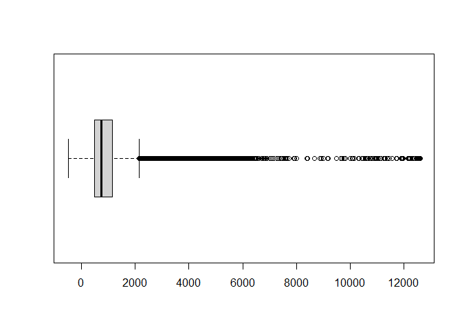
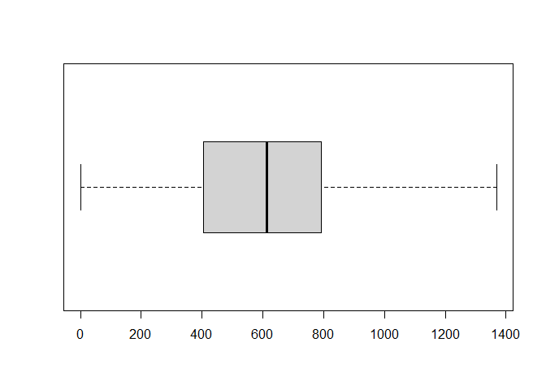
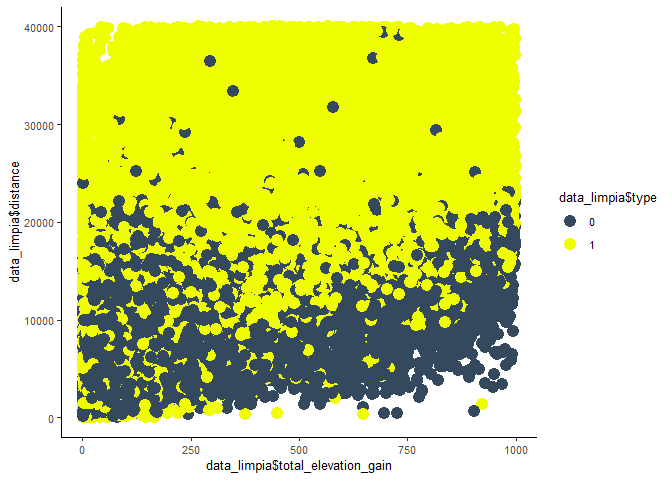

Informe 3
================

### Librerias:

Cargamos las librerias que se utilizarán en este proyecto.

``` r
library(dplyr)
```

    ## Warning: package 'dplyr' was built under R version 4.0.5

    ## 
    ## Attaching package: 'dplyr'

    ## The following objects are masked from 'package:stats':
    ## 
    ##     filter, lag

    ## The following objects are masked from 'package:base':
    ## 
    ##     intersect, setdiff, setequal, union

``` r
#library (tidyverse)
library (ggplot2)
```

    ## Warning: package 'ggplot2' was built under R version 4.0.5

``` r
library(datasets)
library(pROC)
```

    ## Warning: package 'pROC' was built under R version 4.0.5

    ## Type 'citation("pROC")' for a citation.

    ## 
    ## Attaching package: 'pROC'

    ## The following objects are masked from 'package:stats':
    ## 
    ##     cov, smooth, var

``` r
library(discrim)
```

    ## Warning: package 'discrim' was built under R version 4.0.5

    ## Loading required package: parsnip

    ## Warning: package 'parsnip' was built under R version 4.0.5

``` r
library(plyr)
```

    ## Warning: package 'plyr' was built under R version 4.0.3

    ## ------------------------------------------------------------------------------

    ## You have loaded plyr after dplyr - this is likely to cause problems.
    ## If you need functions from both plyr and dplyr, please load plyr first, then dplyr:
    ## library(plyr); library(dplyr)

    ## ------------------------------------------------------------------------------

    ## 
    ## Attaching package: 'plyr'

    ## The following objects are masked from 'package:dplyr':
    ## 
    ##     arrange, count, desc, failwith, id, mutate, rename, summarise,
    ##     summarize

``` r
library(caret)
```

    ## Warning: package 'caret' was built under R version 4.0.5

    ## Loading required package: lattice

``` r
library(tidymodels)
```

    ## Warning: package 'tidymodels' was built under R version 4.0.5

    ## Registered S3 method overwritten by 'tune':
    ##   method                   from   
    ##   required_pkgs.model_spec parsnip

    ## -- Attaching packages -------------------------------------- tidymodels 0.1.3 --

    ## v broom        0.7.7      v tibble       3.1.2 
    ## v dials        0.0.9      v tidyr        1.1.3 
    ## v infer        0.5.4      v tune         0.1.5 
    ## v modeldata    0.1.0      v workflows    0.2.2 
    ## v purrr        0.3.4      v workflowsets 0.0.2 
    ## v recipes      0.1.16     v yardstick    0.0.8 
    ## v rsample      0.1.0

    ## Warning: package 'broom' was built under R version 4.0.5

    ## Warning: package 'dials' was built under R version 4.0.5

    ## Warning: package 'infer' was built under R version 4.0.5

    ## Warning: package 'modeldata' was built under R version 4.0.5

    ## Warning: package 'recipes' was built under R version 4.0.5

    ## Warning: package 'rsample' was built under R version 4.0.5

    ## Warning: package 'tibble' was built under R version 4.0.5

    ## Warning: package 'tidyr' was built under R version 4.0.5

    ## Warning: package 'tune' was built under R version 4.0.5

    ## Warning: package 'workflows' was built under R version 4.0.5

    ## Warning: package 'workflowsets' was built under R version 4.0.5

    ## Warning: package 'yardstick' was built under R version 4.0.5

    ## -- Conflicts ----------------------------------------- tidymodels_conflicts() --
    ## x plyr::arrange()          masks dplyr::arrange()
    ## x purrr::compact()         masks plyr::compact()
    ## x plyr::count()            masks dplyr::count()
    ## x purrr::discard()         masks scales::discard()
    ## x plyr::failwith()         masks dplyr::failwith()
    ## x dplyr::filter()          masks stats::filter()
    ## x plyr::id()               masks dplyr::id()
    ## x dplyr::lag()             masks stats::lag()
    ## x purrr::lift()            masks caret::lift()
    ## x plyr::mutate()           masks dplyr::mutate()
    ## x yardstick::precision()   masks caret::precision()
    ## x yardstick::recall()      masks caret::recall()
    ## x plyr::rename()           masks dplyr::rename()
    ## x yardstick::sensitivity() masks caret::sensitivity()
    ## x yardstick::specificity() masks caret::specificity()
    ## x recipes::step()          masks stats::step()
    ## x plyr::summarise()        masks dplyr::summarise()
    ## x plyr::summarize()        masks dplyr::summarize()
    ## * Use tidymodels_prefer() to resolve common conflicts.

### Cargamos la data:

``` r
data = readRDS(file.choose())
summary(data)
```

    ##        id             type              athlete            calories       
    ##  Min.   :     1   Length:167615      Min.   : 8558143   Min.   :     0.0  
    ##  1st Qu.: 41905   Class :character   1st Qu.:14204866   1st Qu.:   281.0  
    ##  Median : 83808   Mode  :character   Median :15621719   Median :   629.0  
    ##  Mean   : 83808                      Mean   :15359426   Mean   :   816.7  
    ##  3rd Qu.:125712                      3rd Qu.:16685446   3rd Qu.:  1076.8  
    ##  Max.   :167615                      Max.   :18078075   Max.   :326157.3  
    ##     distance         elev_low           records           elev_high        
    ##  Min.   :      0   Length:167615      Length:167615      Length:167615     
    ##  1st Qu.:   6159   Class :character   Class :character   Class :character  
    ##  Median :  12968   Mode  :character   Mode  :character   Mode  :character  
    ##  Mean   :  21998                                                           
    ##  3rd Qu.:  27494                                                           
    ##  Max.   :1479320                                                           
    ##   max_speed         device_name         moving_time        elapsed_time      
    ##  Length:167615      Length:167615      Min.   :       0   Min.   :        0  
    ##  Class :character   Class :character   1st Qu.:    2248   1st Qu.:     2582  
    ##  Mode  :character   Mode  :character   Median :    3853   Median :     4450  
    ##                                        Mean   :    5141   Mean   :    32102  
    ##                                        3rd Qu.:    6516   3rd Qu.:     7934  
    ##                                        Max.   :11025474   Max.   :511111044  
    ##  average_speed      has_heartrate      start_date_local             
    ##  Length:167615      Length:167615      Min.   :1999-04-25 17:36:38  
    ##  Class :character   Class :character   1st Qu.:2016-11-23 17:11:10  
    ##  Mode  :character   Mode  :character   Median :2019-01-26 13:37:56  
    ##                                        Mean   :2018-05-12 07:50:32  
    ##                                        3rd Qu.:2020-04-30 04:33:10  
    ##                                        Max.   :2021-02-02 11:37:09  
    ##  total_elevation_gain
    ##  Min.   :    0.0     
    ##  1st Qu.:   15.1     
    ##  Median :  171.0     
    ##  Mean   :  397.0     
    ##  3rd Qu.:  595.0     
    ##  Max.   :59595.0

En primera instancia observamos que existen 17 variables, dentro de las
cuales concluimos que existen algunas variables que no nos entregan
información valiosa para poder desarrollar este problema por lo que
procedemos a eliminarlas. Estas variables son
“athlete”,“id”,“start\_date\_local”,
“records”,“device\_name”,"has\_heartrate, . Estas variables
entregan información que a nuestro parecer no tiene implicancia en la
resolucíon del problema por lo que analizaremos las otras 10 restantes
para resolver el problema que se nos plantea. Luego procedemos a
eliminar los valora nulos dentro de la data.

``` r
data1<- data[,!(colnames(data) %in% c("id","athlete","records","device_name","has_heartrate","start_date_local"))]
```

``` r
sapply(data1, function(x)sum(is.na(x)))
```

    ##                 type             calories             distance 
    ##                    0                    0                    0 
    ##             elev_low            elev_high            max_speed 
    ##                13519                13519                    0 
    ##          moving_time         elapsed_time        average_speed 
    ##                    0                    0                    0 
    ## total_elevation_gain 
    ##                    0

``` r
data_limpia=na.omit(data1)
```

En el siguiente paso, procedemos a analizar la variable “type”. Esta es
la variable que nostros trataremos de predecir, la cual tiene valores
‘Ride’, ‘Walk’,“EBikeRide”,“Run”,“Hike”. Para este problema dejaremos
dos grandes grupos uno es el grupo de las actividades en bicicleta
(Ride, EbikeRide) y las actividades a pie (walk, run, hike).

``` r
table(data_limpia$type)
```

    ## 
    ## EBikeRide      Hike      Ride       Run      Walk 
    ##       574      2063    100263     48161      3035

``` r
data_limpia$type <- mapvalues(data_limpia$type, from=c('Ride', 'Walk',"EBikeRide","Run","Hike"), to=c(1,0,1,0,0))
str(data_limpia)
```

    ## 'data.frame':    154096 obs. of  10 variables:
    ##  $ type                : chr  "1" "1" "1" "1" ...
    ##  $ calories            : num  521 538 742 314 696 ...
    ##  $ distance            : num  13130 12939 17516 7931 17073 ...
    ##  $ elev_low            : chr  "337.3" "338.5" "301.6" "339.2" ...
    ##  $ elev_high           : chr  "375.6" "477" "377" "389.7" ...
    ##  $ max_speed           : chr  "10.5" "11.4" "11.6" "10.2" ...
    ##  $ moving_time         : num  3908 3791 3837 2280 4188 ...
    ##  $ elapsed_time        : num  4326 4975 4510 2521 4473 ...
    ##  $ average_speed       : chr  "3.36" "3.413" "4.565" "3.479" ...
    ##  $ total_elevation_gain: num  206 288 309 156 269 ...
    ##  - attr(*, "na.action")= 'omit' Named int [1:13519] 31 32 43 44 111 112 113 149 150 196 ...
    ##   ..- attr(*, "names")= chr [1:13519] "31" "32" "43" "44" ...

Podemos observar que las variables average\_speed, max\_speed,
elev\_high, elev\_low estan descritas como caracter por lo que las
transformamos a variables numéricas. Por otra parte la variable “type”
la transformamos a tipo factor.

``` r
data_limpia$average_speed= as.numeric(data_limpia$average_speed)
data_limpia$max_speed= as.numeric(data_limpia$max_speed)
data_limpia$elev_low= as.numeric(data_limpia$elev_low)
data_limpia$elev_high= as.numeric(data_limpia$elev_high)
data_limpia$type= as.factor(data_limpia$type)
str(data_limpia)
```

    ## 'data.frame':    154096 obs. of  10 variables:
    ##  $ type                : Factor w/ 2 levels "0","1": 2 2 2 2 2 2 2 2 2 2 ...
    ##  $ calories            : num  521 538 742 314 696 ...
    ##  $ distance            : num  13130 12939 17516 7931 17073 ...
    ##  $ elev_low            : num  337 338 302 339 336 ...
    ##  $ elev_high           : num  376 477 377 390 389 ...
    ##  $ max_speed           : num  10.5 11.4 11.6 10.2 14.2 6.8 11.5 9.9 15.9 10.1 ...
    ##  $ moving_time         : num  3908 3791 3837 2280 4188 ...
    ##  $ elapsed_time        : num  4326 4975 4510 2521 4473 ...
    ##  $ average_speed       : num  3.36 3.41 4.57 3.48 4.08 ...
    ##  $ total_elevation_gain: num  206 288 309 156 269 ...
    ##  - attr(*, "na.action")= 'omit' Named int [1:13519] 31 32 43 44 111 112 113 149 150 196 ...
    ##   ..- attr(*, "names")= chr [1:13519] "31" "32" "43" "44" ...

### Análisis de Outliers:

Ahora analizamos que existen valores “extraños” o muy espacados de los
valores que se podrian decribir como normales, como por ejemplo un
promedio de velocidad de 2.296 km/h, maxima cantidad de calorías
gastadas de 326.157, etc. Por lo que procedemos a hacer el análisis de
outliers que pueden ser descritos como errores de medición del
dispositivo.

``` r
boxplot(data_limpia$average_speed,horizontal = TRUE)
```

<!-- -->

``` r
boxplot(data_limpia$calories, horizontal =TRUE)
```

<!-- -->

``` r
boxplot(data_limpia$elev_low, horizontal =TRUE)
```

<!-- -->

``` r
boxplot(data_limpia$elev_high, horizontal =TRUE)
```

<!-- -->

``` r
boxplot(data_limpia$max_speed, horizontal =TRUE)
```

<!-- -->

``` r
boxplot(data_limpia$elapsed_time, horizontal =TRUE)
```

<!-- -->

``` r
boxplot(data_limpia$moving_time, horizontal =TRUE)
```

<!-- -->

``` r
boxplot(data_limpia$total_elevation_gain, horizontal =TRUE)
```

<!-- -->

``` r
boxplot(data_limpia$distance, horizontal =TRUE)
```

<!-- -->

``` r
#boxplot.stats(data_limpia$calories)
#boxplot.stats(data_limpia$distance)
#boxplot.stats(data_limpia$elev_low)
#boxplot.stats(data_limpia$elev_high)
#boxplot.stats(data_limpia$max_speed)
#boxplot.stats(data_limpia$moving_time)
boxplot.stats(data_limpia$elapsed_time)
```

    ## $stats
    ## [1]     0  2694  4764  8337 16801
    ## 
    ## $n
    ## [1] 154096
    ## 
    ## $conf
    ## [1] 4741.287 4786.713
    ## 
    ## $out
    ##    [1]     30435     24210     30643     55693     17776     26716     20362
    ##    [8]   1459027     39614     24438     18735     36672     20604     18485
    ##   [15]     17471     20905     20306     20657     20806     19360     51300
    ##   [22]     27902     21752     19300     36244     17438     40833     17276
    ##   [29]     18193     29224     19075     32536     61669     41253     36676
    ##   [36]     26635     24518     64652     23989     18618     27053     17020
    ##   [43]     18847     22973     19216     21407     19306     20063     22433
    ##   [50]     22565     20015     25406     37358     18026     20790     23703
    ##   [57]     17643     21124     19743   1959179     17793    180620     87918
    ##   [64]    166735     48781     38832     79148     90010    429092    176570
    ##   [71]     18970     17728     88360     54092     37702    609119     29809
    ##   [78]    689352     48614   3571450     92194     79581     19291   1123713
    ##   [85]   1088346     80428     32647    625739     87921    561206     77288
    ##   [92]     49370     18370     86524     20526     29047     80814     17448
    ##   [99]     17987     18902     23306     29949     37824    199036     34360
    ##  [106]    199808     19215     26249     18913     19865     22744     20172
    ##  [113]    398588     16915    198988     23722     53744     21297     23704
    ##  [120]     31899    199059     24957     28118     20196     18438     17687
    ##  [127]     26381     17393     20324     24638     18601     16902     18081
    ##  [134]     20584     25759     18045     18534     30941     37129     32222
    ##  [141]     31729     41078     19035     39033     33816     17316     17074
    ##  [148]     21783     19408     20488     67801     17383     18981     33031
    ##  [155]     24273     22303     18720     19796     20458     20719     19763
    ##  [162]     19465     20272     19322     21602     19252     36113     29904
    ##  [169]     17399     18604     26228     18083     38559     19167     27437
    ##  [176]     20324     20679     23884     18751     23611     24939     30911
    ##  [183]     20098     30475     27915     33384     32917     28292     29311
    ##  [190]    348197     18485     23435     18144     24959   1198571     27945
    ##  [197]     19984     23595     18088     21083     23319     17816     26796
    ##  [204]     21173     18367   1047418    767400     16930     18287     20083
    ##  [211]     20415     18987    423301    100430     17473     58520     26719
    ##  [218]     19386     40318     29177     26197     27006     24259     18281
    ##  [225]     70407     36829     20951     17132     31733     48540     25069
    ##  [232]     72435     35170     23909     22484     17547     17257     25986
    ##  [239]     27760     28765     48971     17808     21153     27707     19936
    ##  [246]     16877     18790     90011     21015     22207     17982     30147
    ##  [253]     17061     27884     19513     19233     18711     40742     24007
    ##  [260]     27455     17593     17777     33010     21283     59937     40778
    ##  [267]    101574     19649     19877    969882     32068     16873     27289
    ##  [274]     26176     19874     21329     18616     18371     32829     32829
    ##  [281]     30213     25798     25798     51989     51985     16868     16868
    ##  [288]     41835     25136     33543     25365     20183     16877     26455
    ##  [295]     20638     28324     18424     32539     40135     21690     22164
    ##  [302]     25325     17738     17417     17035     44109     46194     28161
    ##  [309]     19105     18935     19952     24047     28070     22208     24095
    ##  [316]     20472     17872     17619     17154     18939     16836     56209
    ##  [323]     17907     24444     18321     18986     17347     17215     21836
    ##  [330]     18167     18790     38204     27537     18405     33932     24891
    ##  [337]     20162     17577     17978     29496     25274     34476     17387
    ##  [344]     33088     18685     22991     20119     60307     17376     17211
    ##  [351]     31813    198460     26151     30740     30070     17541     18313
    ##  [358]     18895    133631     28427     19014     19196    398091     29609
    ##  [365]     17042     17595     22409     18948     23004     16940     41460
    ##  [372]     32520     20171     17367     41189     36948     27383     26205
    ##  [379]     17809     29923     19519     31604     21788     19136     20247
    ##  [386]     19959     17389     17560     20833     43915     32863     43810
    ##  [393]     38313     34447     29641     20688     17480     18655     20261
    ##  [400]     17586     22444     18645     18489     21474     17827     16873
    ##  [407]     19874     23662     17845     21709     18231     26836     25079
    ##  [414]     28318     26583     18161     18288     38248     24578     25458
    ##  [421]     21205     19359     28908     47808     43752     20880     26045
    ##  [428]     25158     23382  13789542     19742     17171     19779     19811
    ##  [435]     41463     18075     27443     17237     17298     19652     18938
    ##  [442]     27215     17293     20942     31349     17379     18054     25887
    ##  [449]     27327     18202     20811     20362    411081     20297     18148
    ##  [456]     17372     17505     33717     43000     28129     25496     35273
    ##  [463]     39311     27092     38595     31375     50734     19031     20410
    ##  [470]     18040     17214     21522     19953     26944     20955     20849
    ##  [477]     19011     17022     28886     19278     22243     58578     19903
    ##  [484]     47955     18912     25537     17438     40833     32536     61669
    ##  [491]     41253     36676     26635     17886     24497   3084579     42333
    ##  [498]    173353     19901     17733     18694    630453     17011     26426
    ##  [505]     17676     16969     21322     47631     34912     46605     33495
    ##  [512]     35942     39203     38236     27508     28231     20589     21381
    ##  [519]     86270     47521     22112     19757     18483     27225     26571
    ##  [526]     18137    178587     26768     32519     41013     34865     52146
    ##  [533]     41168     32942     43388     17412     33852     31509     48901
    ##  [540]     37348     21100     43500     17208     18322     26295     18807
    ##  [547]     19672     18669     24610     18856     86543     19091     18335
    ##  [554]     19136     18492     22800     18092     29508     25383     26188
    ##  [561]     19664     19097     24023     18816     19904     28217     18386
    ##  [568]     19323     36616     20871     30469     17187     36362     17994
    ##  [575]     17378     45781     17816     22725     19507     20397     21634
    ##  [582]     18143     46961     32493     20861     17564     20113     16936
    ##  [589]     43104     19255     16860     17106     16935     19825     16855
    ##  [596]     17957     19312     27602     38175     22380     20505     20528
    ##  [603]     17389     17434     19629     20667     19435     20695     22209
    ##  [610]     20003     18880     19158     19005     22690     21106     17981
    ##  [617]     17709     18486     17614     17865     18444     20325     23328
    ##  [624]     20243     26067     18050     49969     17433     20152     18175
    ##  [631]     18720     21170     17899     21415     24953     21477    148328
    ##  [638]     19689     21440     20508     24069     17072     85121     27061
    ##  [645]     19118     17758     23799     20410     21574     45638     19377
    ##  [652]     21203     18366     47972     29965    198943     22876     17495
    ##  [659]     17863     19000     86030     92130     21403     16918     20541
    ##  [666]     33899     17576   1868030     17003     33683     17468     41878
    ##  [673]     32743     52557     32457     36192     33876     26163     21089
    ##  [680]    166042     26622     18737     19013     20300     19485     26951
    ##  [687]     23415     23150    108074     26052     18379     19235     24874
    ##  [694]     18779     20296     17893     23656     24515     26424     17031
    ##  [701]     17799     19772     27570     41058     43340     46336     89102
    ##  [708]     37341     35127     26050     18147     18695     17013     18492
    ##  [715]     20496     17467     20849     20733     34138     35570     26236
    ##  [722]     18827     19677     43496     20433     22240     17855     18664
    ##  [729]     17666     17172     21698     17762     32766     22208     19643
    ##  [736]     16833     21604     20198     40982     25095     17851     18372
    ##  [743]     18362     24451     22357     24355     76801     24871     16978
    ##  [750]     21429     17321     29198     25334     19006     23349     30352
    ##  [757]    180556     18405     17375     18566     17258     30307     21015
    ##  [764]     19192     99017     46860     28641     18341     24888     29905
    ##  [771]     19194    342429    105771     36018    261870     48596     39261
    ##  [778]     44203     22507     16897     19541     25837     18672     28542
    ##  [785]     38385     22323     22229     27062     43159     18544     58283
    ##  [792]     43259     88327     17003     20458     28482     28686     24585
    ##  [799]     22732     17928     18748     25946     19495     32726     31911
    ##  [806]     66947     22248     21817    179681     18149     46320     48473
    ##  [813]     19737     19190     19825     18052     19043     17335     18750
    ##  [820]     31089     20793     23706     16939     19168     29719     26449
    ##  [827]     17595     16912     18666     54732     16970     20476     32963
    ##  [834]     37012     17588     20877     18727     20465     20993     18704
    ##  [841]     45115     19519     19075     95197     23409     22000     19868
    ##  [848]     17900    439070     21466     41091     20980     19325     18643
    ##  [855]     25816     22626     16830     21240     21821     83999     18088
    ##  [862]     42842     42000    582614     16805     24548     27393     18689
    ##  [869]     17457     23898     18540     18008     17326     35954     19296
    ##  [876]     17736     34310     62638     24213     17322     24302     20544
    ##  [883]     17977     38948    133316     27825     19073     30416     20165
    ##  [890]     18685     18920     29927     29315   3246161     35629   1073623
    ##  [897]   5751048 104937089     19503     19754     17383     19263     30515
    ##  [904]     37324     17934     19702     43857     17060     20278     30079
    ##  [911]     20221     21140     17240     19271     22241     17769     17021
    ##  [918]     19589     21488     18121     17392     37813     46565     67786
    ##  [925]     18475     19291     23297     20958     18221     19666     17267
    ##  [932]     19728     21538     17005     16968     16958     16921     35054
    ##  [939]     20653     51347     18078     22039     20659    572337     36041
    ##  [946]     24840     19398     24213     17322     20549     20215     19091
    ##  [953]     29060     36744     18585     19050    129292     18539     21533
    ##  [960]     18643     49989     21472     20667     19765     22415     31266
    ##  [967]     20174     50851     17597     19349     18768     29741     22774
    ##  [974]     19589     24894    161509     17741     18850    160881     32039
    ##  [981]     19562     34062     23327     19789     23443     19732     18808
    ##  [988]     17692     22582     30709     17984     17039     17731     22977
    ##  [995]     35264     33062     21358     21643     21021     18965     17992
    ## [1002]     17735     17910     28413     21609     19750     23130     18672
    ## [1009]     23448     22240     17468     20006     39078     20635     17722
    ## [1016]     21391     18611     65270     29375     41739     18341     33041
    ## [1023]     19557     30838     19443     49878     25389     24658     17274
    ## [1030]    175798    337396    459965     21548     19489     21824     21232
    ## [1037]     19956     18382     21529     16907     20469     19657     21075
    ## [1044]     20621     20912    104520     17571     17012     16804     16974
    ## [1051]     59295     17104    295844     21046     17061     20725     27743
    ## [1058]     18393     36239     24211     17085     19343     20301     21400
    ## [1065]     34110     20924     18702     17111     23379     26196     21241
    ## [1072]     20755     20492     41896     20249     17412     20991     17833
    ## [1079]     21146     18498     20822     19448     28019     17090     28026
    ## [1086]     27029     27502     23838     63408     27708     27624     38740
    ## [1093]     18478     24492     22158     17936     17595     29057     20736
    ## [1100]     22784     19212     49580     29719     29827     23269     18803
    ## [1107]     19802     20624     23127     20804     18569     21600     16820
    ## [1114]     24251     19510     18101     22036     36340     22060     20839
    ## [1121]     17395     16917     31169     24506     21218     21396     21385
    ## [1128]     17612     23371     19858     21465     21066     29327     20280
    ## [1135]     17538     18497     19425     20597     17657     34349     18745
    ## [1142]     20023     25376     31963     19541     18920     17850     21316
    ## [1149]     20442     17911     19165     18081     21244     28781     20670
    ## [1156]     21264     33369     32561     28307     30753     25796     20044
    ## [1163]   2203767     30536     20102     28243     31623     65049     17127
    ## [1170]     18342     18713     27324     26063     28414     23119     28364
    ## [1177]     35826     23368     34209     35305     39815     20107     18501
    ## [1184]     17621     17801     22894     28998     21979     17612     23341
    ## [1191]     19800     34139     22908     23061     19978     20865     18018
    ## [1198]     19283     19436     18842     24826     17138     26258     18683
    ## [1205]     23913     22973     25751     20103     96034     20206     20459
    ## [1212]     20526     26116     24429     36565     18825     22449     19333
    ## [1219]     18811     27528     25544     29794     38944     21675     31182
    ## [1226]     21467     39276     17121     24470     31583     31580     20973
    ## [1233]     17630     19007     18424     18021     19165     19397     17683
    ## [1240]     20170     21319     32564     19620     26145     29066     19240
    ## [1247]     36891     19632     37977     18535     19035     19563     17072
    ## [1254]     27193     27192     19019     19401     18036     17442     17098
    ## [1261]     17096     22955     18169     17710     19101     17045     22058
    ## [1268]     20495     23440     20609     20514     30507     22703     22420
    ## [1275]     23660     16839     16985     22562     20724     20383     19646
    ## [1282]     18182     18249     19323     18283     17263     17671     17701
    ## [1289]     18344     31466     21554     23810     28603     25362     34551
    ## [1296]     21481     33609     19766     24364     24364     18836     18531
    ## [1303]     17114     21234     25978     16880     17203     26363     26363
    ## [1310]     17808     17176     31898     31897     26816     19286     17117
    ## [1317]     32988     17583     17797  33231050     20542     18252     20598
    ## [1324]     25252     25262     19556     24205     17701     19659     27104
    ## [1331]     21688     34188     34200     21574     21580     33794     33807
    ## [1338]     21684     21678     23836     19096     19100     21151     22348
    ## [1345]     18482     20552     20971     28123     23364     17909     17912
    ## [1352]     18150     17722     23630     16860     17912     17199     17258
    ## [1359]     16973     20069     16998     20679     18825     19812     17520
    ## [1366]     19199     17042     86844     18909     17569     17245     17261
    ## [1373]     19023     23723     57758     18460     18803     19981     37447
    ## [1380]     19410     16912    138091     20737     17414     20327     23125
    ## [1387]     17495     17720     18079     17087     16900     16900     18346
    ## [1394]     18141     46855     70195     70215     48086     17832     81930
    ## [1401]    186480     22456     86846     19679    219318    167184     97413
    ## [1408]     97412     33984     80374     17563     17613    189789     18419
    ## [1415]     17466     19496     21419     22319     69806     27143     20575
    ## [1422]     41689     29496    110312     17113     17775     19541     20022
    ## [1429]     18696     22397     17134     18967     40194     22008     45425
    ## [1436]     25576     99617     34342   1119798     20426   4738151   4932837
    ## [1443]     43065   2317193     42297     31032     17315     17294     25213
    ## [1450]     20670     41485    449036    152804     21767     18885     31295
    ## [1457]     18285     25149     19224    415992     17818     30196     19582
    ## [1464]    100847     24005     17505   1734169     18027     18159     25974
    ## [1471]     45899     25438     18825     17159     23831     25268     84625
    ## [1478]     19911     22315     23340     19851     19758     22370     18064
    ## [1485]     38748     43363     23376     43812     20417     34207     24656
    ## [1492]     21032     16870     18123     21139     21979     17587     20164
    ## [1499]     18357     41884     18301     29176     25616     31251     21089
    ## [1506]     19922     29676     19189     16941     25551     20266     20929
    ## [1513]     18550     22723     17293     16825     19196     21886     18493
    ## [1520]     16886     39891     17664     17356     30320     17278     17519
    ## [1527]     17994     26527     24623    360736    342165     24540     34365
    ## [1534]     30298     18454     18048     34923     76179     22611     21299
    ## [1541]     21283     18196     25825     38120     20628     18115     26712
    ## [1548]     18576     52420     19464     17231     18872     23362     24467
    ## [1555]     17045     17561     18428     19735     19752     17352     38983
    ## [1562]     20507     36201     20105     24140     17516     22890     35127
    ## [1569]     22020     23552     19656     21512     18692     23196     23038
    ## [1576]     20722     19992     21871     19643     21156     18723     22433
    ## [1583]     23880     20195     28788     17453     37160     18229     18902
    ## [1590]     24519     25371     19873     18605     19584     18424     48393
    ## [1597]     23709     32197     19060     30915     27420     24020     19480
    ## [1604]     20240     19829  76806906     18867     21078     22685     17490
    ## [1611]     19230   1160312     21515     22498     20539     38838     19731
    ## [1618]     22225     16869     28817     16862     20188     26118     22764
    ## [1625]     18968     18742     17469     19120     21222     17124     26016
    ## [1632]     46050     20913     32938     23689     27833     41404     31070
    ## [1639]     22350     21236     16828     17385     19537     17552     52726
    ## [1646]     16939     18752     22052     17487     17987     17174     22165
    ## [1653]     28526     18645     26280     21031     25920     20579     19201
    ## [1660]     16986     20929     18552     22005     20726     26504     21222
    ## [1667]     17114     34965     20406     22578     18707     19050     41251
    ## [1674]     21279     22052     17026     51086     19480     22639     18221
    ## [1681]     22487     22662     19475     24835     18404     18145     20005
    ## [1688]     19828     18146     22327     34634     22649     28470     34195
    ## [1695]     36241     32030     16887     19467     20056     18357     18876
    ## [1702]     21522     23659     21128     22187     30866     49691     35588
    ## [1709]     17965     23682     19192     23241     22509     24292     22797
    ## [1716]     26370     18275     46428     23417     17050     22948     18546
    ## [1723]     20310     32827     18548     19950     21497     17537     21998
    ## [1730]     17525     17105     17578     18299     19723     17759     26865
    ## [1737]     19761     33697     38783     34825     23331     25057     18623
    ## [1744]     88860     32016     24207     24703     25026     17168     48230
    ## [1751]     16882     26373     19739     17413     16991     24263     19478
    ## [1758]     19598    129086     18460     20299     17031     25412     20418
    ## [1765]     17495     17314     21122     24559     28796     18348     25196
    ## [1772]     17259     21045     30909     18448     19520     25709     20249
    ## [1779]     17269     26204     28805     19247     26866     19253     29498
    ## [1786]     16962     20320     17657     17019     33841     26557     28310
    ## [1793]     29115     22274     17915     31310     31221     20263     17787
    ## [1800]     22706     28706     17480     22460     24016     27935     18235
    ## [1807]     25664     23720     26519     21005     16906     21050     18818
    ## [1814]     22938     20228     17708     24091     19361     23948     24562
    ## [1821]     25644     25413    429289     32147     20857     19969     25887
    ## [1828]     24784     20313     26975     27400     22993     21352     17122
    ## [1835]     20984     21296     26017     23747     23185     23598     19056
    ## [1842]     17177     22879     23579     22920     17581     19463     22206
    ## [1849]     24887     17062     16866     33198     19905     18057     26634
    ## [1856]     18243     23749     24544     25747     26205     17936     19186
    ## [1863]     18725     16974     18080     22188     24020     18670     18662
    ## [1870]     43164     34244     20262     22035     19793     18554     17826
    ## [1877]     18219     18889     31917     20331     17114     18263     27210
    ## [1884]     39768     23243     29306     20235     19453     24275     27184
    ## [1891]     19677     20095     81305     17748     19759    116263     20833
    ## [1898]     17601     20973     23818     19249     56489     16911     17168
    ## [1905]     17169     25660     90398     33030     84399    170437     84256
    ## [1912]     21554     20445     61544    252317     17231     18429     20315
    ## [1919]     34813     29011   1053055     18254    523129     20814     63455
    ## [1926]     83188     28044    128708     22955    175735    139686     29002
    ## [1933]     86256     85488     23354     20304     18202     18402     86316
    ## [1940]    246806     64060     18017     18063     17359     20207     36581
    ## [1947]     18125     25903     21693     35241     37536     20586     26989
    ## [1954]     21585     22397     26668     49013     48596     38335     18492
    ## [1961]     20254     19561    140497     18643     17387     35554     36437
    ## [1968]     17991     25707     36616     39911     22603     19366     23635
    ## [1975]     24840     20063     19355     17774     18615     21965     67144
    ## [1982]     17809     42954     19882     35202     17233     30449     18791
    ## [1989]     17497     20519     27684     17692     31777     24721     18754
    ## [1996]     18220     22421     21718     23808     25363     24863     18723
    ## [2003]     18732     20518     27222     20053     28610     18551    341011
    ## [2010]     27633     18898     19883     17923     22720     16859     23476
    ## [2017]     18777     29341     21144     28144     17336     23945     17144
    ## [2024]     20501     17339     16909     19389     20040     17099     19152
    ## [2031]     18578     31341     20458     19609     26268     16882     17275
    ## [2038]     18806     27390     18921     19061     19646     30177     22881
    ## [2045]     17082     17918     18464     17238     17096     18696     17403
    ## [2052]     18640     22238     26578     17163     31538     17788    916113
    ## [2059]     62740     30398     80588     32441     19902     25425     17176
    ## [2066]     22187     19991   1693277     22852  30024640     16872    349039
    ## [2073]     18757     20899     20209     33841     17834     16817     20002
    ## [2080]     27865     21757     19135     26614     26911     18599     31161
    ## [2087]    314758     39977     53601     21170     19171     19853     29215
    ## [2094]     30850     22098     23173     18404     20644     32578     33247
    ## [2101]     32945     30964     20404     18714     21842     22338     18924
    ## [2108]     19880     17839     22778     20045     29788     16855     36059
    ## [2115]     25936     23049     24981     18949     31602     17161     21599
    ## [2122]     30472     24301     27140     28206     23077     29323     28023
    ## [2129]     26323     27347     21089     32498     23951     20832     20879
    ## [2136]     34657     20558     21062     25410     39254     34016     17372
    ## [2143]     21700     21280     19977     26359     16890     24737     23389
    ## [2150]     33887     19169     17488     19348     22471     22972     18618
    ## [2157]     20082     17718     16926     18695     16914     22748     21989
    ## [2164]     17394     34248     17799     17499     19327     21286     21832
    ## [2171]     25540     23241     17784     20293     26040     22086     19192
    ## [2178]     26509     34301   6349188     19837     18418     21555     20316
    ## [2185]     29801     21416     18894     29320     18882     17275     17335
    ## [2192]     20120     19725     29170     20879     25700     17934     19924
    ## [2199]     19422     17189     20292     21496     17179     19477     35275
    ## [2206]     18059     17408     20235     21207     20595     19430     16887
    ## [2213]     23932     19216     18727     17109     23198     18069     43294
    ## [2220]     17701     20229     22510     32645     23287     20101     17770
    ## [2227]     19487    389349     19384     27141     18972     17029     18904
    ## [2234]     17920     27746     16962     29465     17231     29178     18484
    ## [2241]     26035     19492     30550     22910     18896     20602     27311
    ## [2248]     23092     24979     22469     21396     20659     18554     22541
    ## [2255]     29936     36374     21566     19609     30833     17813     29283
    ## [2262]     21780     16962     17891     19555     22428     20987     20195
    ## [2269]     17422     17321     18282     17138     30063     17651    117274
    ## [2276]    398601     79222     22668     18023     23433     16942     19057
    ## [2283]     28151     17044     24170     22919     19616     17197     37369
    ## [2290]     31015     28934     17996     19206     20821     20524     20350
    ## [2297]     27191     30470     20235     18353     17681     19173     26374
    ## [2304]     24801     19303     19742     18864     19946     37775     41349
    ## [2311]     18319     16934     24959     19419     25986     23874     18077
    ## [2318]     17831     17214     17798     19858     17545     17272     25689
    ## [2325]     30948     43902     18362     21152     18699     26774     19601
    ## [2332]     19985     18931     26983     26758     23881     17018     32019
    ## [2339]     17677     17706     21974     17566     18646     16922     20049
    ## [2346]     21564     27966     18525     20559     19626     21841     23815
    ## [2353]     18621     35021     17426     26949     34179     19535    139386
    ## [2360]     29187     16921     21206     28131     16993    900643    606060
    ## [2367]     42409    131360     17577     18855     17612     18612     22029
    ## [2374]     18409     24990     36258     46801     44099     47482     23026
    ## [2381]     52223     89382     21524     23400     25104     23784     30341
    ## [2388]     17279     22645     17359     19336     24021     18826     17350
    ## [2395]     19176     23591     19694     19241     19605     17274     18703
    ## [2402]     17581     30341     18437     19455     37037     35030     34705
    ## [2409]     19121     36258     42399     31056     20001     18264  67740525
    ## [2416]     22565     18148     20586    517140     21755     18770     19997
    ## [2423]     16868     19922     20210     18452     17854   1121071    688953
    ## [2430]     23353   7105406     32194   1809103     40542     17608     18095
    ## [2437]     20411     17484     16983     21913     26896     19151     24357
    ## [2444]     17881     18485     19139     22999     18426     18435     36954
    ## [2451]     18994     19314     20520     35838     19715     16914     26164
    ## [2458]     16822     26219     18806     37778    183430     18080    169769
    ## [2465]    200167    150768     41758     41408     28078     25194     16818
    ## [2472]     35744     26219     25337     26061     21472     20908     18980
    ## [2479]     22473     18744     22510     17676     17593     19904     20597
    ## [2486]     19595     20350     33019     36553     24649     30380     19156
    ## [2493]     48220     17457     21981     17798     22836     18908     20085
    ## [2500]     20540     19384     24992     19284     17523     20866     22466
    ## [2507]     16989     17092     19936     21627     21381     17891     22935
    ## [2514]     21175     26206     18146     45518     22984     27022     16946
    ## [2521]  22618100     18413     20872     17821     17952     16885     20385
    ## [2528]     86392     17245     30941     30947     34811     31607     41078
    ## [2535]     41095     29731     37897     33865     17527     17242    166040
    ## [2542]     24073     37365     96833     22796     19540     84129     17915
    ## [2549]     19785   3557293     20139     43051     32285     17595     18379
    ## [2556]     21059     17367     30081     18196     19842     20324     65355
    ## [2563]     17252     17180     29870     17624     17098     17776     20105
    ## [2570]     20981     95890     20802     17343     19245     17616     17778
    ## [2577]     28288     19124     16871     17156     25686    167618     19297
    ## [2584]     21013     42335     17601     37175     20680     25741     20149
    ## [2591]     18334     18115     17883     17227     16852     20222     22676
    ## [2598]     19465     20406     17870     17782     28924     21044     46834
    ## [2605]     36028     17653     17823     19224     19742     28651     35313
    ## [2612]     32611     16986     19326     19584     20915     18592     21594
    ## [2619]     30020     17272     28847     35961     23907     26177     30589
    ## [2626]     32644     25923     19704     39621     26780     21158     42499
    ## [2633]     17342     17297     20551     19134     26622     25896     25657
    ## [2640]     17678     17984    369198    258298     18628     20165     17872
    ## [2647]     18621     18442     36823     18885     17766     17326     20203
    ## [2654]     23450     23671     18477     17532     17993     19287     21665
    ## [2661]     25510     35947     30685     18655     18222     19779     21343
    ## [2668]     17809     41373     29777     38108     22276     61048     34560
    ## [2675]     23641     18302     24325     30734     17257     19464     17171
    ## [2682]     22444     29918    684026     39424     37931     27877     20303
    ## [2689]     32130     29320     22401     17984     31897     39271     19792
    ## [2696]     29198     19426     40897     37727     19651     30343     29190
    ## [2703]     24390     86376     27484     19547     17178     28559     26754
    ## [2710]     21737     90287     17627     24420   3515467     24669     25502
    ## [2717]     33497     27248     26911     26532     19904     18262     19934
    ## [2724]     17501     17731     17313     18068     22115     18152     20692
    ## [2731]     18437     17679     19130     19041     17951     28639     40980
    ## [2738]     19880     23309     20021     25264     17220     20011   2418893
    ## [2745]     27618     38606     20309     28653     42526     22686     21355
    ## [2752]     30582     17785     18125     18025     20537     22552     20325
    ## [2759]     18208     17892     22827     39510     19540     23966     23140
    ## [2766]     21116     19588     24220     27981     34680     19594     27166
    ## [2773]     34673     34852     41081     38817     36286     36136     22247
    ## [2780]     19104     19840     24603     23826     18118     17336   3103161
    ## [2787]     22243     25795     37549     46273     26225     51053     32944
    ## [2794]     30180     43251     82472     24141     58306     25140     19572
    ## [2801]     25641     31298     30519     19094     17255     17773     17343
    ## [2808]     16986     20309     18933     47639     20593     17222     18967
    ## [2815]     28755     18262     17184     30470     39594     36984     19598
    ## [2822]     17217     41832     20957     18767     17665     20024     17539
    ## [2829]     20543     21869     21367     24123     17972     87994     26246
    ## [2836]     26677     27004     17495     17957     50484     22651     20139
    ## [2843]     18732     26091     21949     17617     28057     59083     20790
    ## [2850]     20389     18773     23703     17796    169221     33534     18981
    ## [2857]    245444     87033     36964     17769     17545     20690     28682
    ## [2864]     17719     42992     27526     17726    124521    507573  10548786
    ## [2871]     30660     21153     17468     31665     23188     19587     30862
    ## [2878]     42214     34424     38705     31893     22891     19220    147884
    ## [2885]     16997     17772     17773     20595     58485    803665     21124
    ## [2892]     17423     19322     17076    443800     20983     30917     17282
    ## [2899]     56579     39575     25665     18717     40789     18535     20493
    ## [2906]     54457     21049     86324     19800     19001     19729     18394
    ## [2913]     16887     28793     27227     31635     39219     27489     17872
    ## [2920]     53445     43502     84092     18510     20340     40927     33372
    ## [2927]     25996     20466     18180     27575     16855     35694     17963
    ## [2934]     47440     21326    168844     29233     19351     65545     21364
    ## [2941]     42858     19091     17490     17832     23962     18839     27298
    ## [2948]     19985     17079     18605     34755     17213     23383     22542
    ## [2955]     39485     16923     39987     17393     22706     25650     16803
    ## [2962]    215924     20659     23519     17086     17234     20776     20946
    ## [2969]     18143     17122     17714     17098     16815     20517    475330
    ## [2976]    181754    171274  13345949   1008960     80590     19407     25005
    ## [2983]     18107     37810     35632     22885     26274     24743     34655
    ## [2990]     41390     22492     19575     18325     17597     21248     17484
    ## [2997]     16811     20612     26227     25870     17647     16843     17644
    ## [3004]     25977     18157     22972    295622     29909     19885     17789
    ## [3011]     17765     25443     17258     26706     17775     17704     18110
    ## [3018]     17398    297863     17918     29173     19285     77415     30489
    ## [3025]     17241     32044     92363     22744     25254     22600     18502
    ## [3032]     39255     41565    207359     19802     17940     20471     18313
    ## [3039]     20741     16972     20471     19572     24190     69916     19335
    ## [3046]     17085     27052     31926     19869     18591     25464     18979
    ## [3053]     17695     17828     17728     34039     20380     22183     26132
    ## [3060]     19167     18052     17757     27925     19955     20108     17190
    ## [3067]     17204     17589     20903     18654     16867     18820     18146
    ## [3074]     21023     17631     17861     17620     23923     24204     18061
    ## [3081]     19131     22175     20481     21714     16852     17497     22502
    ## [3088]     23811     25744     24216     22252     23429     18683     20120
    ## [3095]     17911     20981     23947     20187     18041     18887     17239
    ## [3102]     21711     16903     17383     23209     18068     18832     17463
    ## [3109]     21549     18814     19536     21122     23155     18581     21358
    ## [3116]     22349     16815     24089     17295     20305     17208     17744
    ## [3123]     17000     25056     22336     16998     20585     19010     24718
    ## [3130]     17654     26928     24571     21044     20316     21952     17085
    ## [3137]     18494     20071     17012     26748     18825     20950     22511
    ## [3144]     18587     21960     19367     24298     19805     16857     17985
    ## [3151]     17673     17490     17111     17461     20238     22296     24965
    ## [3158]     23550     18232     17462     17058     24819     19856     17206
    ## [3165]     27789     20554     22250     21684     17655     29417     27880
    ## [3172]     18589     18973     19410     17364     18998     28176     17804
    ## [3179]     17255     32627     23053     19088     60604    171856     18419
    ## [3186]     18208     19076     28289     23245     31033     25051     20457
    ## [3193]     21584    385486   2551604    293685     66705    155256    118317
    ## [3200]    391238     84986     60727     23305     17279     18107     19753
    ## [3207]     18304     17760     18987     17442     36520     18745     25376
    ## [3214]     30557     18916     18095     16909     19374     32407     29717
    ## [3221]     17505     26606    385417    248298     34823     38438     27391
    ## [3228]     19798     19714     19039     23057     19258    184128    259403
    ## [3235]     25656     21761     17807     21843     37387     19521  14975243
    ## [3242]     21445    695228     38277     23111     20159     21925     87206
    ## [3249]     16941     37362     22729     16956     18830    173420     92748
    ## [3256]     22264     24730     18271     42041     58799     34415     17332
    ## [3263]     22977     87364     18638     27926     19746     22487     16839
    ## [3270]     21892     22401     17651     68968    696253     24856     19482
    ## [3277]     21535     19901     20295     17982     73761     21188    605599
    ## [3284]     21227    600528     17727     37432     31311     19866     24898
    ## [3291]     17276     38295     19216     18200     17349     21170     21406
    ## [3298]     42505     17197     20790     23667     18101     20263     18207
    ## [3305]     19808     36182     19880    404397     94121     54458     35498
    ## [3312]    645713     35516     88104     40677     16975     25709     28611
    ## [3319]     20901     25044     17604     18581     20650     28029     23312
    ## [3326]     18517    114218     17295     18179     25089     20698     41388
    ## [3333]     18557    617302    139643     85010     62420    542997    515172
    ## [3340]    632055    250390     18591     17442     17615     30353     25256
    ## [3347]     84994     87947    240921     36331     50249     21179     27745
    ## [3354]     92087     20930     23104     17204     21646     20993     20710
    ## [3361]     19023     20617     41707     29915     22615     94194     93349
    ## [3368]     22936     34651     25221     19983     25073     17326     46751
    ## [3375]     50838     21671     16839     22982     20969     18202     20327
    ## [3382]     29834     18287     17051     18395     20852     17223    271505
    ## [3389]   2690279     18739     68162     21804     28434     17179     44394
    ## [3396]     95339     94312     21189    165226     78018     18351     20423
    ## [3403]     17694     23514     25941     27439     17483     18423     54380
    ## [3410]     54380     31842     27450     34171     18476     18166     27293
    ## [3417]     23313    173612     20612     20611     18481     22482     20207
    ## [3424]     69992     93753     19806     42316     18953     46520     29926
    ## [3431]     17057     28834     21031     17566     21073     57826     32473
    ## [3438]     21004     21830     29086     32770     24554     18354     17445
    ## [3445]     40475     17014     18004     37826    135363    464516     46993
    ## [3452]     20309     54749     20040     18754     16996     17971    119257
    ## [3459]     50343     18638     20515     16876     24250     18280     21101
    ## [3466]     20082     21390     52880     20195     22218     18834    180513
    ## [3473]     19033     25162     23611     24207     28528     34067     27006
    ## [3480]     21873     16944     43231     17473     54061     29600     21996
    ## [3487]     18858     19669     18214     18922     16927     22158     44255
    ## [3494]     91187     16969     22603    137386     32290     31020     30966
    ## [3501]     18278     19061     18369     16858     20219     20424     22786
    ## [3508]     23267    351951    136387     27259     17844     24447    349776
    ## [3515]     19540    269546     17348     16874    604983     32676     28118
    ## [3522]   1113794    267348     22647     18955     19666     16841    337795
    ## [3529]    956485     23754 247658308     19203     19321     21046    701582
    ## [3536]     17989     21188     18393     17030     23065     18003     21373
    ## [3543]     17361     19102     17657     16904     18612     22981     17715
    ## [3550]     17318     19948     21338     18951     19525     31284     19887
    ## [3557]     34267     22997     16852     20758     21649     19900     22618
    ## [3564]     18627     19742     21491     22936     28345     22430     17023
    ## [3571]     17556     19917     58012     92103     27230     23127     19243
    ## [3578]     52518     51442     30702     19276     21749     78163     18634
    ## [3585]     18103     28408     59134     18877     17332     46744     20147
    ## [3592]     17455     17781     17973     17072     33446     26870     20190
    ## [3599]     18147     32430     32816     30793     18297     19779     17175
    ## [3606]     17253     92233     27587     62109     24647     99380    116956
    ## [3613]     19786     84171     20309     23294     85840     23050     27854
    ## [3620]     23174    220995     22876     19137     22297     21774     19007
    ## [3627]     18940  86653786 195396766     22700     24624     33092     31852
    ## [3634]     31604     22135     17824     27300     27828     20324     16861
    ## [3641]     46740     27228     27304     31461     22916     28644     24503
    ## [3648]     31317     24752     16942     20128     18759     22719     22614
    ## [3655]     25909     23489     18267     25986     27544     26473     28462
    ## [3662]     52465     22231     23323     20209     21933     18675     26941
    ## [3669]     17800     18461     17875     17483     17644     20473     17023
    ## [3676]     21118     17425     16940    557753     18440     17076   3543655
    ## [3683]     20574     20453     26253     18292     18262     20022     19546
    ## [3690]     19590     17170     18800     32000     31904     38039     31624
    ## [3697]     40205     29994     38888     32311     17911     21644     19274
    ## [3704]     24912     19844     20115     90627     18344     17663     26363
    ## [3711]     22603     19902     17241     16810     18093     22902     18631
    ## [3718]     21785     18746     24014     18571     17172     19220     24377
    ## [3725]     19455     21650     19098     27360     17921     18195     19442
    ## [3732]     25593     16996     21551     17081     25528     26492     22593
    ## [3739]     33436     87595     20400     21468     29998     19796   1804896
    ## [3746]     18337     22212     21094     19742     17307     16936     23220
    ## [3753]     17452     40026     19008     17643     17978     17917     17236
    ## [3760]     20063     17280     27779     18624     18686     23291     23406
    ## [3767]     47724     21537     18774     22161     20033     17117     31359
    ## [3774]     17545     27695     20085     25327     30319     20168     17578
    ## [3781]     19561     20059     22728     17044     17778     20216     21706
    ## [3788]     18068     17917     21010     24448    696361     17357     17017
    ## [3795]     16834     19339     17415     18398     20484     31886     32004
    ## [3802]     17044     36492     35379     33372     21086     20602     16859
    ## [3809]     26066     31434     20471     16821     32351     36670     34011
    ## [3816]     31749     39812     41887     43955     35329     35390     19912
    ## [3823]     37622     19460     34339     19293     41869     32799     23811
    ## [3830]     20019     19623     24480     19377     19951     18122     17847
    ## [3837]     17535     17933     19844     20721     17550     17191     48072
    ## [3844]     46109     38003     38884     20825     43000     19980     38559
    ## [3851]     21078     17973     18679     17996     44374     41231     52578
    ## [3858]     40387     38779     44655     44262     41403     41349     27984
    ## [3865]     26821     34040     37562     35855     31171     22853     18772
    ## [3872]     18781     17382     23268     23203     24790     17329     20225
    ## [3879]     24615     18756     18209     17247     18112     17683     23136
    ## [3886]     21549     18359     18426     19300     20340     26731     25813
    ## [3893]     29506     17648     21184     23467     21402     20354     17880
    ## [3900]     17375     18318     29324     16842     39023     18870     28176
    ## [3907]     28198     27692     19716     43076     29409     20756     17236
    ## [3914]     32382     30616    122211     21043     19616     19477     34053
    ## [3921]     25770     38691     19927     18562     24769     20417     20776
    ## [3928]     21009     18900     19295     17845     19661     17309     17757
    ## [3935]     18066     20177     22395     18102     17432     35092     18684
    ## [3942]     17056     22770     25713     16987     37963     26915     21993
    ## [3949]     27996     18459     30835     25934     23175     17683     20343
    ## [3956]     95077     18575     44417     24796     16817     22484     19939
    ## [3963]     18433     16983     86545     44986     85434     52017     55081
    ## [3970]     52655     43287     54993     46410     43065     41814     41755
    ## [3977]     42068     43285     47149     42125     40948     20409     18377
    ## [3984]     17323     18310     23612     18791     18584     17063     17024
    ## [3991]     16852     25821     26872     19705     26626     34125     24754
    ## [3998]     23541     19335     22338     19408     24118     24973     25861
    ## [4005]     20165     48777     27747     27630     36612     37706     19878
    ## [4012]     26813     43504     40272     41185     33592     34855     23766
    ## [4019]     19781     21279     18452     26817     17838     18002     17763
    ## [4026]     18132     19233     19286     25314     18482     27898     22925
    ## [4033]     21062     43223     41858     41946     46735    106455     40888
    ## [4040]     41711     41786     47323     41095     39744     55987     55574
    ## [4047]     44866     42233     40289     86193     42677     40130     41095
    ## [4054]     40920     41501     43458     40682     19116     19733     20615
    ## [4061]     18316     20872     23488     24686     21077     19248     17588
    ## [4068]     42763     29118     23990     20508     36559     34516     49510
    ## [4075]     19856     37387     21649     16824     17206     19773     17334
    ## [4082]     36136     27829     25431     48973     20245     17700     17122
    ## [4089]     45777     40910     41759     44187     44358     39938     40115
    ## [4096]     38036     42945     42951     43028     50490     41943     41605
    ## [4103]     40032     39064     39488     42465     42785     34829     40117
    ## [4110]     18352     18314     23136     34112     36897     37306     26180
    ## [4117]     38579     34769     36216     20337     16804     17454     17842
    ## [4124]     23400     18742     21803     29104     19615     17642     21804
    ## [4131]     19709     18418     18633     31262     17887     21825     20543
    ## [4138]     18253     20245     18552     16803     17012     24677     42292
    ## [4145]     43270     38515     18199     17902     18018     17002     23750
    ## [4152]     17007     22737     17028     16873     29591     19353     17119
    ## [4159]     21117     19972     26625     16907     17738     39038     31852
    ## [4166]     19890     17211     20792     22445     17335     24892     37484
    ## [4173]     18417     22648     17801     22778     17777     18522     16836
    ## [4180]     21743     32263     28550     17147    259205     75082     17691
    ## [4187]     19579     25302     28286     17097     60646     19758     17481
    ## [4194]     22135     26462     19959     18184     26190     17164     23422
    ## [4201]    273604     17967     62987     20901     22868     18008     18025
    ## [4208]     25929     16888     16827     18853     26123     18257     30092
    ## [4215]     18779     19694     23290     17797     17333     18957     20514
    ## [4222]     18282     16935     18865     19534     26265     17013     17208
    ## [4229]     19572     19324     17600     17461     19545     22477     23538
    ## [4236]     19748     22200     34332     18471     24587     18175     21487
    ## [4243]     28969    103805     23716     21111     19071     17043     26844
    ## [4250]     20639     20662     22891     26587     30658     17317     22041
    ## [4257]     20474     20188     18547     19366     17314     18725     17172
    ## [4264]     19680     17030     22004     17644     19353     22663     27591
    ## [4271]     18504     22848     28226     16824     18361     19741     18902
    ## [4278]   1400751     52057     17712     30391     30507    183441     29423
    ## [4285]     17742     18221     18099     16820     20061     19743     20317
    ## [4292]     25138     85757     46759     24365     26153     25454     26769
    ## [4299]     18043     17585     19210     19896     31512     18691     19761
    ## [4306]     32259     17985     32473     28029     20521     17213     44835
    ## [4313]     44722     27008     17436     19895     17335     17622     19334
    ## [4320]     25370     24627   3568374     47402     18147     17784     28257
    ## [4327]     20385     16956     17946     72011     49360     21195     20623
    ## [4334]     18263     17513     25152     24513     33630    120030     20380
    ## [4341]     19367     16881     19797     18727     79558     19714     17147
    ## [4348]     23257     23236     18892     17768     16858     19920     41771
    ## [4355]     17988     21212     28903     28610     32598     25861     26494
    ## [4362]     16880     17600    220414     33987     17148     20538     20009
    ## [4369]     26356     17840     16956     18754     23387     18695     18515
    ## [4376]     26765     24697     19072     18669     49021     28139     19557
    ## [4383]     16830     17290     18555     18263     17824     18833     22388
    ## [4390]     22301     22851     21252     20330     19833     36345     24999
    ## [4397]     34570     27156     26589     25334     20466     20507     26981
    ## [4404]     19261     31198     17221     22019     17169     17264    167020
    ## [4411]     20666     19938   1605037     33203     27721     18494     32254
    ## [4418]     30534     18441     18816     26703     19846     18089     28416
    ## [4425]     20104     33480     18472     16888     86975     20626     18416
    ## [4432]     22266     28993     24134     28681     28024     32588     28867
    ## [4439]     26043     19277     60477     24994     25001     21805     18536
    ## [4446]     18884     20917     42642     30277     17354     16940     19010
    ## [4453]     21189     19593     17256     18188     17287     17149     22012
    ## [4460]     19517     43589     26692     20749    909135     27055     17157
    ## [4467]     23231     35779     29995     19636     20036     17059     17023
    ## [4474]     17525     20245     19112     16971     26125     28736     17449
    ## [4481]     18078     18827     19539     25472     17425     22809     54146
    ## [4488]     25482     16935     20113     19513     18193     64447     20506
    ## [4495]     19932     18868     21023     27128     18370     27578     17054
    ## [4502]     17863     21363     17344     17361     17855     17674     26060
    ## [4509]    164647     50544     17743     31835     17989     26671     19308
    ## [4516]     18284     20218     18845     24256     17623     20935     36425
    ## [4523]     16925     18674     19359     17232     23840     19941     17323
    ## [4530]     18117     30217     22255     23946     23427     22124     16943
    ## [4537]     19080     22040     48545  94254841     20357     23345     46397
    ## [4544]     25850     58337    206048     17105     21219     16999     21728
    ## [4551]     19577     18079     39636     19090     26781     25228     21854
    ## [4558]     19971     73220     24840     18406     18227     30078     16809
    ## [4565]     16815     17794     19801     25444     17107     19650     68092
    ## [4572]     19041     29061     18087   2982933   2426359    347540     19160
    ## [4579]     25896     23817     29663     24814     25677     22399     31948
    ## [4586]     20286     17209     37129     19097     54569     17131     19446
    ## [4593]     17230     18452     19041     30275     23575     20939     53732
    ## [4600]     21988     17849     16864     18394     17829     23531     38977
    ## [4607]     18141     17497     25903     20299     24965     18125     16819
    ## [4614]     20452     17576     21014     20192     20120     17439     17843
    ## [4621]     49175     19296     27550     19628     23007     17762     17172
    ## [4628]     20950     22071     32964     27564     17656     19386     20505
    ## [4635]     31995     17603     19351     37606     26380     19212     21130
    ## [4642]     17402     20384     29945     17335     17912     20230     20145
    ## [4649]     91612     32474     17178     21410    294976     20208     19325
    ## [4656]     17226     21991     20005     22325     23855     24891     17058
    ## [4663]     31360     19891     30053     18062     22404     20130     23926
    ## [4670]     62840     78491     17756     21426     21438     17218     32322
    ## [4677]     19386     23851     45375     18918     23516     19439     22786
    ## [4684]    166849     17994    217153     17483     21670     27870     23274
    ## [4691]     26845     22223     25457     23836     19596     20610     31876
    ## [4698]     17244     30605     18477     27082     18191     17064     17227
    ## [4705]     38159     17993     32952     21941     28838  62420036     19200
    ## [4712]     17042     20547     19826     23098     26971     17379     18724
    ## [4719]     20463     21529     29338     20283     17700     18842     17475
    ## [4726]     81050     17377     19695     18482     22160     19760     24264
    ## [4733]     81325     17627     81229     27626     23543     19546     22488
    ## [4740]   2281934     24393     17596    136719     23208     18305     24274
    ## [4747]     28965     21053    290585     21696     20310     19099     18326
    ## [4754]     17419     20917     18744     17891     20147     17156     19788
    ## [4761]     17284     16885     26127     26970     20182     36916     21185
    ## [4768]     17479     26709     26938     30013     18765     22811     22402
    ## [4775]     17241     24298     33869     29451     31240     19104     31443
    ## [4782]     27119     22519     17408     18860     20660     27110     36118
    ## [4789]     23572     18758     17339     31444     86740     23056     17754
    ## [4796]     63190     19837  10440595     24852     18638     42152     19508
    ## [4803]     30901     17776     18320     21145     23427     16806     17591
    ## [4810]     22661     83812     18144     53519     18719     18751     19725
    ## [4817]     91163     18747     18937     43726     18679     17747     28181
    ## [4824]     28591     26310     20669     18432     20674     34601     49346
    ## [4831]     25105     27272     29880     21321     20787     17348     17684
    ## [4838]     17425     17838     20274    142387     20555     23391     19533
    ## [4845]     16926     17228     34838     38883     25732     18904     16970
    ## [4852]     91034     24706     24703     18412     18511     20426     18147
    ## [4859]     17740     23172     17456     19860     17537     18152     18289
    ## [4866]     32116     16994     17784     92717     18377     21062     17709
    ## [4873]     19930     26006     46296     41476     40838     25594     25779
    ## [4880]     37043     19260     17016     20129     20202     17146     18428
    ## [4887]     17503     18000     17485     30581     18855     17278     17875
    ## [4894]     97043     19521     18270     18588   3143524     37312     31668
    ## [4901]     35315     18687     18310     18776     22886     21955     18534
    ## [4908]     35889     32834     22010     26333     19433     19052     17956
    ## [4915]     18974     31132     17377     19081     16909     20235     19462
    ## [4922]     18708   4227452     18355     34515     22611     23559     23437
    ## [4929]     19692     27856     20182     17635     17371     20139     19667
    ## [4936]     21365    257395     85008     24480    104985     18232     18057
    ## [4943]     26176     19276     27763     18359     16984     21114     18426
    ## [4950]     20948     19202     17834     23321     17838     18412     24981
    ## [4957]     25993     17803     22445     31811     25459     19709     32442
    ## [4964]     17900     18307     17463     17322     16954     21474     75401
    ## [4971]     22201     19762     20147     25130     19538     16919     17785
    ## [4978]     19758     21858     20016     17060     19280     17585     18471
    ## [4985]     19495     21516     18120     21186     32516     41100     25801
    ## [4992]     19975     17914     18539     17453     17502     42778     21774
    ## [4999]     26411     20960    280253     19484     17128     19731     16825
    ## [5006]     20263     17299     20336     17587     25546     18570     18838
    ## [5013]     17459     31060     17369     18093     19857     18344     17035
    ## [5020]     17870     19807     17115     22444     22184     24992     18470
    ## [5027]     21496     21293     16870     18175     26754     17294     26676
    ## [5034]     17496     17576     17956     20936     16984     21348     18054
    ## [5041]     24165     21491     20433     26345     25826     17270     25671
    ## [5048]    431168     35274     20212    137793     19333     25411     25147
    ## [5055]     23517     58195     48318     18221    165397     18555     41660
    ## [5062]     21310     20644     19275     20107     21622     17296     18910
    ## [5069]     16950     23665     35275     25959     38957    199077     71066
    ## [5076]     17935     16947     19517     18977    335360     17045     21788
    ## [5083]     23494     20205     21662     86696     18880     21482     20895
    ## [5090]     69276    264262     45380     92690     19555     17678     18479
    ## [5097]     18259     19482     18060   1011448  14190292     22160     31370
    ## [5104]     18430     49546     35414     21489     24892     22907     16906
    ## [5111]     20441     84578     35541     29429     29731     26998     25029
    ## [5118]     29572     21229     18236     21325     23514     17588     19443
    ## [5125]     16927     30145     18884     25254     22769    302884     20528
    ## [5132]     22880     19473     20607     20234     32357    237105     23532
    ## [5139]     19338     17845     19043     17893    138824    121274     19222
    ## [5146]     21511     42394     18616     35902    106696     34517     73245
    ## [5153]     16895     18216     37492     31479     42900     36462     34405
    ## [5160]     19073   1149029   1665539     28158    157715     18037     22460
    ## [5167]     17099     18196     20940     35477     32344     23410     18580
    ## [5174]     23082    259456     25949     16825     18405     24183     18703
    ## [5181]     24208     24790     22569     39908     19075     21049     19122
    ## [5188]     29006    429941    115085     17335     22418     19231     22456
    ## [5195]     22550     35434     18902     18699     22095     23185     37236
    ## [5202]     22179     21858     18024     17621     23753     33506    691694
    ## [5209]    317930     18710     22326     16844     17611     20103     17767
    ## [5216]     20690     17380     29814     30334     17972     18365     18571
    ## [5223]     20355     24968     19910     20151     20247     20599     19676
    ## [5230]     17164     16870     19436     33095     16873     87851     77472
    ## [5237]     25426     18132    193344     19934     17339     19876     18742
    ## [5244]     18181     20786     18699     28803     55978     42916     19976
    ## [5251]     27013     17485     20670     18850     34854     16917     17240
    ## [5258]    628181     21699    166670     22345     17511     27195     19910
    ## [5265]     38285     23701     17185     45756     24170     22484     19857
    ## [5272]     22719     19170     19272     20690     19575     29086    113285
    ## [5279]     19887     23277     29339     44257     16887     19651     18003
    ## [5286]    176867     26796     18602     24641     20042    175210     44139
    ## [5293]     22679     17667     20175     27919     17604     17922     37596
    ## [5300]     20452     18844     23704     51323     17868     25184     17453
    ## [5307]     17800     21941     26040     21040     18755     22149    704847
    ## [5314]     19941     19837     37853     19125    427701    377176     17927
    ## [5321]     16870     20881     18359     19251     24990     23209     19528
    ## [5328]     22707     22288    329669    309862     21998     25919    313859
    ## [5335] 377464622     18670     19815     21804     27752     22896     24953
    ## [5342]     18768     20286     17910     20790     22083     26657     30013
    ## [5349]     19596     16945     16959     18492     22273     17507     21640
    ## [5356]     44563     18437     18738     16958     17431     21761     19457
    ## [5363]     21903     30827     31456     18053     20103     17675     22213
    ## [5370]     19452     19880     20678     18123     20699     20773     19053
    ## [5377]     18816     17388     18171     22721     17886     24226     18154
    ## [5384]     27479     22969     20503     17528     25622     16808     18403
    ## [5391]     20341     21527     17792     18020     33545     27348     17725
    ## [5398]     30242     17151     17667     25206    134393     18839     17214
    ## [5405]     18843     18529     20212     25781     18595     23686     29963
    ## [5412]     18869     17207     20757     26063     20433     20660     24952
    ## [5419]     19636     20724     18065     19823     20002     21069     16887
    ## [5426]     17295     26037     24064     18506     30715     17425     18871
    ## [5433]     36719     21472  17185912     18614     19118     44130     18673
    ## [5440]     21681     17426     20931     23886     91479     19712     17814
    ## [5447]     19062     21856     17265     18002     16860     16911     17368
    ## [5454]     17597     20063     20921     17708     22075    294151     17340
    ## [5461]     19757     20200     20003    160022     19168     86329     62246
    ## [5468]     17150     19068     17634     19464     56360     23251     34960
    ## [5475]     17365     49456     18780     16993     19774     22550     19949
    ## [5482]     32482     31159     33161     21413     18660     20249     21590
    ## [5489]     19900     29685     18581     17355     25571     35152     21751
    ## [5496]     23806     30785     30558     18010     23445   1295336   1132133
    ## [5503]     29929     23686     56811     20204     43803     17552     17774
    ## [5510]     18344     19352     58595     19843     81372     23965     16961
    ## [5517]     17977     19240     25051     65368     18560     17408     25482
    ## [5524]     21893     17170     24475     16985     18070     17507     31467
    ## [5531]     25503    312394     18315     17563     21347     22946     22029
    ## [5538]     17634     19646     21363     18431     17344     17202     17282
    ## [5545]     16831     19161     23717     20440     20230     17043     20001
    ## [5552]     46702     18794     17246     16959    288537     26565    487780
    ## [5559]     21146    709492    309350    372885    514935     88587    336952
    ## [5566]    522508    593752    663366   1359069     99587    516932     86350
    ## [5573]    513501    508380     18163     19234     17151     16999     17643
    ## [5580]     63402    610025    266422    587216     18033    333476    121996
    ## [5587]     54818     17220     51685     18523 387979240     21592     17110
    ## [5594]     19781 388497176 511111044     23855     21956     28229     19230
    ## [5601]     19540 509024893     21218     16917     19687     18080     19380
    ## [5608]     17032     19202     34858     18389     18424     17344     17331
    ## [5615]     17820     21883     18248     19197     17116     17776     17456
    ## [5622]     21205     17183     27755     19333     20685     20533     18165
    ## [5629]     24470     21509     27723     28656     95695     28258     22420
    ## [5636]     31494     20049     18031     25726     23941     17980     44789
    ## [5643]     22833     17402     33078     22038     18841     23282     28534
    ## [5650]     21885     88236     30157     55983     17250     21846     69475
    ## [5657]     32592     18968     16878    128772     55417     33244     20316
    ## [5664]     33806     24341     17620     17872     17001     46305     16832
    ## [5671]    493608    579066    158389     32710     17878 154824220     18514
    ## [5678]     17477     17947 133072340     19639     49674     24907     19730
    ## [5685]     21797     20105     19600     17771     19511     49385     52594
    ## [5692]     23350     19882    106499     18363     22260     20456     17726
    ## [5699]     22470     28349     27332     36743     16811     20522     18760
    ## [5706]     18009     47624     28673     38331     34825     19829     19468
    ## [5713]    125239     23752     18197     51590     63062     40544     23963
    ## [5720]     19962     18554     21610     19199     46753     20696     19576
    ## [5727]     18391    101986     54045     34181     32773     16961     17922
    ## [5734]    227637     20061     19246     18243     24176     74647     26059
    ## [5741]     36501     17074     25735     17451     18704     45342     86413
    ## [5748]     20040     19029     84270     17268     23080     18889     84524
    ## [5755]    140620     27360     17725     21622     19266     25218     18015
    ## [5762]    255703     20741     18221     27585     20607    284600     16860
    ## [5769]     16945     18439     20069     24053     25897     21872     16867
    ## [5776]     20858     19184     26792     19575     18493     19579     18842
    ## [5783]     19811     19053     18127     19576     20341     24059     27499
    ## [5790]     18428     25736     17013     17643     18654   1040025    354420
    ## [5797]   4419623    177954    334539     50660     17820     26244     21437
    ## [5804]     17146     33259     21724     17220     18949     73229     56831
    ## [5811]     19452     17952     22230     20112     20460     19552     16861
    ## [5818]    173138     40499     60982     26417     16991     23280    185938
    ## [5825]     31919     38485     37560     23534     25344    506089     33920
    ## [5832]    165975     19355     17694     18683     20019     41289     22320
    ## [5839]     84629     17431     18173     18262     20615     17286     17946
    ## [5846]     40387     19215     19729     17682     21460     21524     24657
    ## [5853]     22742     19257     20234     25336     31962     28486     22690
    ## [5860]     17288     16871     20106     33282     31615     19608     18308
    ## [5867]     21181     35434     24565    259521     23061     21841     18448
    ## [5874]     18502     20568     17814     23094    122109     43035     18188
    ## [5881]     21001     26705     23815     35895     20565     17672     17739
    ## [5888]     18828     39599     41007     22161     19959     18339     18041
    ## [5895]     21335     28259     16911     37799     34097     20365     17536
    ## [5902]     23214     18407     22502     87210     17643     26110     20444
    ## [5909]     18849     24228     21160     23357     19458     21242     17121
    ## [5916]     20866     18755     30110     24590     17232     18001     22882
    ## [5923]     53558     25773     19085     18048     24970     18107     17730
    ## [5930]     16891     27384     17404     30326     30032     18604     34182
    ## [5937]     17762     27913    103458     19010     18362     41327  11517181
    ## [5944]     24118     18889     34097     41007     18950     25955     16967
    ## [5951]     24407     18754     55565     17237     17624     18157     27644
    ## [5958]     22872   3909482     23160     21992     36748     18139     29222
    ## [5965]     20919     20739     18386     34003     23484     18023     86839
    ## [5972]     24648     17121     19664     18496     30610     45919     20256
    ## [5979]     26215     67194    481521     19957     99238     20399     34812
    ## [5986]     34827     17022     18769     29705     26093     17553     17772
    ## [5993]     25268     17635     19835     22929     20633     32125     27386
    ## [6000]     19923     19256    190375     20654     23521     16921     17773
    ## [6007]     17926     17926     34022     16892     17252     23211     20551
    ## [6014]     39353     16930     17772     18256     18496     21271     22448
    ## [6021]     23452     17614     32864     16842     35713     19270     20128
    ## [6028]     17154     45509     17165     18677     17237     16807   2422399
    ## [6035]     20763     19755     17667     23035     20151     18595    110129
    ## [6042]     20681     19075     25129     24011     18949   3033517     23828
    ## [6049]     16976    188994     33872    149712   4095968     24494     23618
    ## [6056]     17742     17692     21795     23618     19528     17851     24819
    ## [6063]     21459     21248     31195    172064     26193     22084     26901
    ## [6070]     24383     20446     17359     18388     18407     18413     17927
    ## [6077]     36223    144887     18709     45416     19616     18697     17856
    ## [6084]     24074     23060     19874     19183     19258     18427     24653
    ## [6091]     34980     27463     17984     23938     20746     25597     18263
    ## [6098]     18351     16927     18075     26528     17891     24220     25912
    ## [6105]     18551     23412     17200     16917     18805     17624     17372
    ## [6112]     17865     74363    181212    140830     22675     85091     24506
    ## [6119] 179240351     17185     17664     29619     31307     22465     17066
    ## [6126]     20568     33069     18273     17355     19035     24034     17077
    ## [6133]     33816     19473     19615     22919     18471     17038     17875
    ## [6140]     26131     29556     29157     24821    178564     17051     30941
    ## [6147]     19449     41557     27115     23895     25757     21063    132175
    ## [6154]     17340     22895     20193     20009     25314     19573  10361193
    ## [6161]     23930     17879     38730     88831     20783     18443     30216
    ## [6168]     27869     47557     18366     21495     21458     17451     27052
    ## [6175]     32094     20566     18632     31283     21983     17881     23172
    ## [6182]     21419    167882     27137     36585     23629     16807     22606
    ## [6189]     24611     24442     24373     20719     17319    247902     17611
    ## [6196]     19687     41327     16805     30153     17879     41078     30271
    ## [6203]     29252     31181     17196     18680     17396     17919     26253
    ## [6210]     38308     45919     45919     18614     18794     21361     17007
    ## [6217]     19487     35612     17731     40682     17831     18557     37129
    ## [6224]     28769     17050     28053     22279     32222     27937     28199
    ## [6231]     17499     24148     24810     24134     21838     22041     20830
    ## [6238]     32063     17343     26032     26580     19033     17672     40345
    ## [6245]     43873     19494     18492     20466     20653     20701     43901
    ## [6252]     17383     17500     17160     32440     30358     17418    961829
    ## [6259]     21123     16812     18315     27402     17891     34233     18374
    ## [6266]     48385     25602     18127     21899     76793     19992     73202
    ## [6273]     39296     30441     19017     19915     30672     24148     19794
    ## [6280]     21330     29310     18264     29205     20848     39884     20398
    ## [6287]     24698     18443     30460     17573     17705     17331     18220
    ## [6294]     18879     31729     40188     23502     28749     28801     32597
    ## [6301]     23689     21750     19581     41671     21962     23270     29724
    ## [6308]     23595     19464     17396     17377     20784     32739     21600
    ## [6315]     19094     25284     30241     18574     24608     17199    457239
    ## [6322]     29115     26655   1397207     19545     20413     17996     23884
    ## [6329]     19276     18673     17065     21745     17994     17591     17982
    ## [6336]     22348     17511    206254     83191    139329     28845     20428
    ## [6343]     20214     21359     19309     17369     23023     27486     34543
    ## [6350]     31800     41730     39897     17381     44017     19885     21582
    ## [6357]     28758     21481     18495     26527     29065     27031     22039
    ## [6364]     17464     18390     17270     24698     21356     19206     18767
    ## [6371]     19121     19123     46245     18750     31396     26590     20650
    ## [6378]     21376     21500     18544     18622     16987     17256     25262
    ## [6385]    153073     21408     16806     18190    527169     19747     22628
    ## [6392]     17982     20946     20983     16993     17421     17632     20176
    ## [6399]     20526     19223     23952     17117     20965     17161     25182
    ## [6406]     24659     21240     28882     21196     17005    102868     35836
    ## [6413]     29749     38305     34373     18156     19591    199036     27111
    ## [6420]     19830     27598     18550     20178     31437     19119     86473
    ## [6427]     19824     18876     17604     23225     27342     22377     29011
    ## [6434]     20953     41341     23879     19652     18204     21800     21101
    ## [6441]     19412     17280     17856     19933     33577     17826     18836
    ## [6448]     19612     18008     19165     18474     18156     17933     19524
    ## [6455]     78824     27705     19126     18031     30374     50418     30269
    ## [6462]     25335     17985   1029620    643023     32793     21712     24876
    ## [6469]     20359     16884     24039     17155    119673     34549     16932
    ## [6476]     21124     23967     19640     16827     17089     16939     16957
    ## [6483]     18075     41430     36284     27735     21814     64949     24905
    ## [6490]     17266     20086     52080     27618     17410     73474     51569
    ## [6497]     17212     17376     35148     20168     18815     45584     47678
    ## [6504]     16803     20946     58961     21216     19253     21092     18583
    ## [6511]     17457     18852     21264     22376     21179     18341   6078138
    ## [6518]     17156     30091     17384     22000     19749     18775     17957
    ## [6525]     17211     18516     36343     18437   1966738     25254     18950
    ## [6532]     17889     28302     20613     18723     48274     52411     55528
    ## [6539]     21626     24853     21231     20274     22568     29218     22568
    ## [6546]     43359     27658     31725     20597     29713     17393     25673
    ## [6553]     18541     26809     27702     24282     18077     32254     20584
    ## [6560]     22523     20068     20584     20362     20346     18799     29096
    ## [6567]     38952     25765     37250     23907     20298     19239     25964
    ## [6574]     21519     42257    171010     46371     16983     19214     18013
    ## [6581]     27829     18639     19115     27087     61014     26675    602029
    ## [6588]     24239     24881     17847     21209     32674     18466     20005
    ## [6595]     25284     18816     19445     18314     17322     22963     17548
    ## [6602]     19999     17942     18219     29857     17678     17779     19298
    ## [6609]     25790     20900     17413     17360     18731     36564     29383
    ## [6616]     19015     19399     20722     26637     21950     19856     20962
    ## [6623]     18753     20347     19601     21295     21358     21451     21540
    ## [6630]     17035     22899     23110     18641     18900     24531     19705
    ## [6637]     19637     18211     18346     91538     19528     16953     19047
    ## [6644]     19504     18253     17953     18063     18915     17978     53147
    ## [6651]     17162     17486     17612     18620     19474     21054     17502
    ## [6658]     19820     22397     22963     17976     23930     23154     19540
    ## [6665]     19070     18387     23605     16975     28798     24093     29197
    ## [6672]     22346     26450     20001     17799     21455     21094     22957
    ## [6679]     18351     23134     18389     45096    381527     17389     18300
    ## [6686]     18018     28862     20765     21236     19719     17957     21869
    ## [6693]     31673     17105     18832     16819     56362     36986     47270
    ## [6700]     51370     17681     17138     73199     19957     45226     26134
    ## [6707]     18719     17510     18174     18597     19227     16895     17478
    ## [6714]     18305     19162     17478     16933     20569     19003     19230
    ## [6721]     17497     17135     20121     19042     19866     25991     24861
    ## [6728]     17103     24485     18630     22332     22525     17896     29744
    ## [6735]     19291     31880     22175     19169     19440     22411     25317
    ## [6742]     17953     17469     19502     21928     16811     21182     21113
    ## [6749]     17957     19023     17609     22184     24994     22066     17923
    ## [6756]     20022     22534     42500     32019     17752     21113     89779
    ## [6763]     17958     17043     18060     19446     17066     28116     17573
    ## [6770]     27495     23881     17455     18343     17419     19124    365858
    ## [6777]     20793    365858     18896     19374    463129    250418     22453
    ## [6784]     34232     27630     20094     20401     32569     31095     20714
    ## [6791]     43041     18414     19613     17624     19526     17969     18478
    ## [6798]     17158     19358     17742     23614     23218     25642     16924
    ## [6805]     28918     26284     22235     27309     28918     29757     21302
    ## [6812]     17213     28779     26975     19736     23456     18683     17229
    ## [6819]     21107     21117     20923     19350     23742     21276     18153
    ## [6826]     18238     19706     20943     21473     17330     29947     29902
    ## [6833]     18227     35802     43204     24722     20794     24069     74657
    ## [6840]     16977     56660     21389   6375910     38027     54051     18110
    ## [6847]     72965     18252     18025     67502     19041     17794     17385
    ## [6854]     17886     44043     21484     19883     39181     33457     21328
    ## [6861]     20890     20637     20017     43989     23726     23889     23251
    ## [6868]     20622     23954     18806     26912     21012     18318     18363
    ## [6875]     26941     23360     69762     17344     17452     18080     21055
    ## [6882]     29004     20602     25257     25081     22607     19930     22073
    ## [6889]     21979     22817     22261     19194     18216     23659     17670
    ## [6896]     21381     24703     21643     23383     26017     22194     22913
    ## [6903]     22086     18135     21929     29561     85131     18191     18582
    ## [6910]     24413     22481     28804     17962     86518     25284     30964
    ## [6917]     22290     17078     18337     17900     16902     21487     20863
    ## [6924]     34264     21256     19892     25533     18120     17016     19793
    ## [6931]     17103     39374     21995     17576     22056     19011     23018
    ## [6938]     22862     22015     25313     17742     22715     18439     19049
    ## [6945]     40895     53563    374444     19998     22689     18537     33530
    ## [6952]     16916     16810     18483     25746     24386     24529     18003
    ## [6959]     16906     17155     25465     25454     26230     19205     21901
    ## [6966]     24081     33624     45794     17564     17315     17524     17694
    ## [6973]     19861     18071     21521     16833     23005     17736     22640
    ## [6980]     19631     17331     21968     27837     16811     27711     68898
    ## [6987]     27893     17182     19000     37073     16995     20664     17243
    ## [6994]     17002     26645     20662     17171     16920     26858     18272
    ## [7001]     19376     18444     25998     17669     18660     19828     25819
    ## [7008]     25594     17557     24848     19028     22114     17169     35767
    ## [7015]     28981     18737     17278     21387     36638     52426     16806
    ## [7022]     23713     19404     18200     17801     31590     43512     17108
    ## [7029]     46334     23033     31420     31404     31180     17429     20798
    ## [7036]  11025474     22336     24833     18468     22896     22840     20627
    ## [7043]     22440     19099     18938     21322     22941     16913     31230
    ## [7050]     18010     22128     23790     35760     21002     29103     17301
    ## [7057]     42676     19182     20659     24787     29551     29551     17855
    ## [7064]     20954     16899     18080     19662     18660     22746     23010
    ## [7071]     28972     28218     22142     25800     22080     17272     19781
    ## [7078]     23446     24221     17850     45507     33723     17791     33203
    ## [7085]     25356     20828     24251     20247     20524     23939     18302
    ## [7092]     24036     21314     85970     23704     22088     33498     30242
    ## [7099]     17290     18059     22114     32621     22305     19826     17050
    ## [7106]     39426     24660     17109     17895     20329     26128     18108
    ## [7113]     18237     26101     17393     19082     20329     19665     20179
    ## [7120]     17405     23148     25534     22681     21463     31553     17641
    ## [7127]     22655     21523     21909     19031     19769     34622     19044
    ## [7134]     24762     37264     16867     21717     19905   4301019     17050
    ## [7141]     86525     19287     18036     23166     19179     20268     22606
    ## [7148]     17534     17310     21155     27399     25769     34273     22642
    ## [7155]     27789     36269     17369     47055     19131     20194     17034
    ## [7162]     22929     16861     24724     23399     19330     22325     19267
    ## [7169]     45757     16824     45021     17186     17280     17167     17287
    ## [7176]     18679     63858     62474   1166235     18710     17159     16967
    ## [7183]     17418     19940     17024     18414     18401     17251     18232
    ## [7190]     25932     20455     16891     17047     19092     16991     17339
    ## [7197]     16864     33749     23402     39050     21762     28351     23424
    ## [7204]     17101     19955     20067     21875     16967     28103     27383
    ## [7211]     18132   1813556     89270    155273    100614     45627     54700
    ## [7218]    115655     87277     24017     21981    512407    187895     55400
    ## [7225]    186662     70915     19130     32567     17282     19650     41714
    ## [7232]     26741     24099     19298     17239     35925     37788     17836
    ## [7239]     23025     20960     21063     30794     22434     27736     23434
    ## [7246]     22169     30794     22434     27736     26811     35925     19985
    ## [7253]     19650     43451    179011     17307     78377     28049     18110
    ## [7260]     24656     60461     20548     61904     25708     19896     33148
    ## [7267]     31974     33906     33813    502400     57333     81199     32890
    ## [7274]     23621     18665     17145     24185     25603     25629     24896
    ## [7281]     33169     24869     25417     19828     20616     17586     18331
    ## [7288]     19415     24873     17458     19639     19726     24824     19001
    ## [7295]     16831     22521     17471     24009     24417     20018     22318
    ## [7302]     17541     21021     34811     26850     23910     27359     78716
    ## [7309]     20458     32156     32863     33619     33378     20317     17770
    ## [7316]     44376     36389     34695     47642     19432     65423     19959
    ## [7323]     17903     18341     17453     18957     19900     20768     18567
    ## [7330]     18177     23187     17905     21397     18233     24213     35692
    ## [7337]     34789     21751     17232     17295     23767     28384     17869
    ## [7344]     23780     19602     23431     21841     24266     26319     84677
    ## [7351]     18295     35330     60784     26378     24903     21554     71461
    ## [7358]     89686     17100     18353     20793    110215     19410     19536
    ## [7365]     19553     19080     20803     17389     24705     20365     23179
    ## [7372]     21393     20609     21035     21726     17136     25592     21652
    ## [7379]     20377     17961     19235     19115     20344     36152     18022
    ## [7386]     27256     17425     22116     17431     19082     22376     18458
    ## [7393]     17827     20718     24172     17434     16827     23164     16821
    ## [7400]     18718     24743     18295     19095     26629     26917     28739
    ## [7407]     23363     18631     22988    100974     19648     29504     25861
    ## [7414]     48869     48772     37052     45980     17720     17679     23162
    ## [7421]     18276     21415     16860     21082     23316     22044     18825
    ## [7428]     18410     34113     24313     20920     40482     19636     40967
    ## [7435]     22420     18435     38019     21330     18768     21330     23827
    ## [7442]     30199     18566     20971     17288     18432     18643     22184
    ## [7449]   2936200     18823     20805     34629     16809     23146     19552
    ## [7456]     26959     25680     44786     17335     16982     27975     35015
    ## [7463]     25210     33084     25436     32561     18913     22224     22900
    ## [7470]   3325499     18346    266775     44791     28871     18250     25487
    ## [7477]     17534     27748     20794     16952     73203     28861     21911
    ## [7484]     27600     17821     18131     23569     16924     38609     20360
    ## [7491]     21056     25683     44785     84223     22650     26391     27875
    ## [7498]     18751     34033     17397     27431     26670     18588     26762
    ## [7505]     17462     93631     28118     17188     16844     17149     17161
    ## [7512]     18201     19752     17680     19989     27219     17929     18002
    ## [7519]     19953     18120    172970     20031     24396     18189     43605
    ## [7526]     22296     21152     23587     26646     21111     21914     18618
    ## [7533]     16945     19004     39460     26892     18035     20862     17428
    ## [7540]     19473     17427     59259     18803     22835     16808     32365
    ## [7547]     30001     32036    539507    539507     32036     24220     19057
    ## [7554]     21513     17779     27672    227820     24141     17966     21832
    ## [7561]     17310     25497     17144     17860     24474     19198     16989
    ## [7568]     19170     19329     28072     17063     22734     17347     18696
    ## [7575]     17828     34100     21440     47206     18908     20048     27601
    ## [7582]     16923     19610     24681     24898     22879     17603     18082
    ## [7589]     41696     20021     18213     20766     18140     20118     18163
    ## [7596]     18632     16829     24928     25917     28175     34225     24284
    ## [7603]     31100     21888     19812     25769     16817     20770     17958
    ## [7610]     30963     24657     22999     18232     18022     18109     21843
    ## [7617]     17206     23831     25531     17426     17459     37108    173404
    ## [7624]     96688     21991     19453     36058     37541     22369     28804
    ## [7631]     26597     49470     26505     23931     23364     35950     38274
    ## [7638]     19330     23177     34634     55372     19822     19417     19693
    ## [7645]     17202     17224     23290     17598     20111     22809     20851
    ## [7652]     25532     21964     19491     18599     35282     20017     20702
    ## [7659]     20852     32549     20699     21747     25863     17400     22439
    ## [7666]     18945     20621     19033     17699     18603     39436     38966
    ## [7673]    110477     39564     17015     16887     16941     17079     17063
    ## [7680]     22167     19215     24850     20155     24239     17869    102637
    ## [7687]     20214     61390     21729     21180     17414     19424     24381
    ## [7694]     17194     18885     17751     17344     29795     27129     21925
    ## [7701]     29734     22093     17537     21537     32972     24806     25035
    ## [7708]     26795     22124     29039     26650     41160     27855     28948
    ## [7715]     27468     20083     22677     19031    279249     36602     22218
    ## [7722]     41202     39457     21403     30934     34314     35535     36609
    ## [7729]     22326     20005     21515     18073    102527     21462     17201
    ## [7736]    634349     18570     16896     18086     17306     19915     17589
    ## [7743]     88541    152996     27200     82987     18119    108222    361843
    ## [7750]     19009     22876     26843     17379    188569     26390     22170
    ## [7757]     18141     26181     25805     18584     19675     20590     21717
    ## [7764]     17658     18772     20257     19678     19070     20797     23484
    ## [7771]     28297     21097     23467     18035     20474     29202     33019
    ## [7778]     18414     18836     19621     24573     20080     20123     17974
    ## [7785]     17179     19081     18303     31919     24223     18200     17535
    ## [7792]     37336     20585     23169     19692     17614     18288     42065
    ## [7799]     31146     17293     28634     26693     19960     22888     26025
    ## [7806]     22867     17579     17137     19031     19211     16910     19441
    ## [7813]     19275     19180     17992     17818     23504     24281     74411
    ## [7820]     21420     19427     30246     19503     30190     17539     74213
    ## [7827]     28949     74160     23905     18147     19999     16881     18590
    ## [7834]     17113     20847     22385     31806     19808     18355     19490
    ## [7841]     19749     97448     25128     23733     17532     17428     18894
    ## [7848]     17375     38948     17976     17997     18565     18177     19244
    ## [7855]     20314     23862     19594     19939     21348     20286     18605
    ## [7862]     21348     23396     18017     27733     18246     16842     34264
    ## [7869]     23396     42061     24494     24240     31122     17281     16944
    ## [7876]     16802     18833     20459     18131     18000     18834     18549
    ## [7883]     23604     23617     21743     54878     21229     31365     43549
    ## [7890]     19719     19590     20521     17947     16908     21670     18932
    ## [7897]     20562     34004     51906     20832     21219     19110     18210
    ## [7904]     28181     21297     18296     18858     19508     18836     19578
    ## [7911]     25333     18898     16894     17020     17167     17017     16936
    ## [7918]     17017     21185     20629     23656     33283     29727     31351
    ## [7925]     54132     20112     89240     18758     16857     17197     17909
    ## [7932]     17173     21499     17626     21607     22331     26354     20055
    ## [7939]     22176     32469     55516     35805     21769     42534     25387
    ## [7946]     16968     27855     20490     20151     17890     17130     16997
    ## [7953]     51918     42961     42136     40145     20644     21824    156747
    ## [7960]     46239     32193     24413     37243    141442     19422    232867
    ## [7967]     43727     17941     17890     17137     16888     18879     17129
    ## [7974]     19686     18590     20816     21572     24101     19878     19866
    ## [7981]     22661     23610     21270     23471     36873     27602     30371
    ## [7988]     17014     16987     17652     18482     18006     16963     17795
    ## [7995]     24303     21789     24353     20232     17116     24277     20885
    ## [8002]     17980     18963     24527     19323     30474     16980     27964
    ## [8009]     18026     16837     21147     24308     19596     17320     25654
    ## [8016]     18721     24790   1875191     16997   5970837     44866     33713
    ## [8023]     25903    419834     18261     17046     21521     17833     17854
    ## [8030]     17533     18501     23612     29031     19902     24530     23417
    ## [8037]     22994     22490     25422     20267     19022     35893     50235
    ## [8044]     17162     21610     22310     23136     17278     18088     27037
    ## [8051]     30531     22578     17804     16875     28900     19487     23675
    ## [8058]     27915     18096     23047     19210     19682     21242     19392
    ## [8065]     29259     29450     16912     30495     17482     22169     18363
    ## [8072]     20990     22871     16884     22472     23616     21766     18972
    ## [8079]     17321     25653     17611     16948     19434     23259     19222
    ## [8086]     32742     20962     82361     23683     26831     44479     19663
    ## [8093]     18458     17833     18932     20132     18146     27722     21315
    ## [8100]     37810     45157     24606     16959     18342     28708     17001
    ## [8107]     23580     16870     19368    118001   1032466     21091     25041
    ## [8114]     20041     16819     18181     17371     41077     18167     18491
    ## [8121]     39910     20260     78646     19653     40692     17020     36388
    ## [8128]     22909     23439     19572     18799     23043     18196     22832
    ## [8135]     89230     43574     82414     20263     19032     19135    938877
    ## [8142]     18436     45700     20728     17302     19785     25947     17329
    ## [8149]     17102     18096     19744     31731     19084     21936     20547
    ## [8156]     47367     21684     28068     17456     28859     18866     20130
    ## [8163]     32082     36134     37321    574909    605909     17686     90794
    ## [8170]     26307     27554     17319     24834    101971     17917     32325
    ## [8177]     20758     36513     22788    150979     19621     17131     19058
    ## [8184]     18146     17703     18473     22943     28341     22229     20738
    ## [8191]     18098     20899     17433     29346 133015858     16969     16957
    ## [8198]     19680     16885     18134     20738     17321     19252     19230
    ## [8205]     18586     19619     17142     19417     16963     21955     17553
    ## [8212]     20883     36248     17714     20852     23213     20916     45718
    ## [8219]     20187     20336     19015     20208     22071     35235     19316
    ## [8226]     18623     18761     27833     17233     20798     24014     38963
    ## [8233]     21897     18296     19312     17445     20108     20240     27720
    ## [8240]     40397     22192    170192     32267     19530     24124    791958
    ## [8247]     18839     16820     17131     18272     20433     20651     23025
    ## [8254]     31342     24966     16870     16824     20783     24694     40777
    ## [8261]     16887     21160     16824     16817     17206     17103     23196
    ## [8268]     18915     22140     25362     16808     17144     18605     17804
    ## [8275]     26753     17904     17210     19575    128836   2649006     19167
    ## [8282]     26921     18362     17109     17416     19555     17303     23141
    ## [8289]     20166     21545     22289     17362     18368     17082     18576
    ## [8296]     22089     21969     17902     23139     19293     27438     17131
    ## [8303]     21016     17477     16966     18289     18675     17046     22836
    ## [8310]     20743 137259037     18988     18663     31161     18536     20813
    ## [8317]     21423     22487     21872     70148     18599     87553     17560
    ## [8324]     18910     34760    162696     87230     19141     83869     22378
    ## [8331]     19561     19775     17290     27390     24311     32622     81401
    ## [8338]     80905     17846     20581     94245     53466     42246     17467
    ## [8345]     17104     33387     21636    164333     26227     23178     21990
    ## [8352]     25269     19711     26576     17557     18461     19757     43256
    ## [8359]     33001     21364     26610     17326     20576     19415     17957
    ## [8366]     16964     17960     17479     18288     16859     18043     22420
    ## [8373]     17122     24826     29831     18797     18198     20268     20156
    ## [8380]     23284     23150     17147     17785     17313     19368     18378
    ## [8387]     24816     19288     18549     21198     27378     28401     46673
    ## [8394]     25573     19022     31297     17643     27280     24732     38652
    ## [8401]     21307    432554     17376     18664     19624     23475     18995
    ## [8408]     29380     29973     76064     17750     19902     21041     21342
    ## [8415]     22724     78184     24153   3323394    347028     17552     18740
    ## [8422]     19475     16935     21550     21549     19606     24167     20122
    ## [8429]    112927     24732     18379     17643     23040    116769     34377
    ## [8436]     27112     24643     23875     21845     21312     17446     17909
    ## [8443]    428472     24376     22640     31385     37838     37879     23044
    ## [8450]     18217     18402     22088     19240     32410     22913     19922
    ## [8457]     18002     18135     19220     25084     22337     19938     27670
    ## [8464]     17741     16840     18002     23568     23545     18725     19335
    ## [8471]     24411     27985     26619     26928     38913     40389     43593
    ## [8478]     43737     44033     18792     43593     23534     79260     85984
    ## [8485]     40963     19250     17281     17507     18406     18222     20084
    ## [8492]     20125     20372     21170     18942     21257     20755     16842
    ## [8499]     17947     21941     20062     27902     18913     20990     23446
    ## [8506]     20072

``` r
#boxplot.stats(data_limpia$average_speed)
#boxplot.stats(data_limpia$total_elevation_gain)
```

Una vez analisada nuestra data variable por variable procedemos a
eliminar los valors “0” de nuestra data y los valores outliers que estan
por sobre el cuarto cuartil

``` r
data_limpia=filter(data_limpia, calories>0, calories<2300)
data_limpia=filter(data_limpia, distance>0, distance <40000)
data_limpia=filter(data_limpia, elev_low>0, elev_low<1370)
data_limpia=filter(data_limpia, elev_high>0, elev_high<1975)
data_limpia=filter(data_limpia, max_speed>0, max_speed<30)
data_limpia=filter(data_limpia, moving_time>0,moving_time<10000)
data_limpia=filter(data_limpia, elapsed_time>0, elapsed_time<11711)
data_limpia=filter(data_limpia, average_speed>0,average_speed<9)
data_limpia=filter(data_limpia, total_elevation_gain>0,total_elevation_gain<1000)
```

``` r
boxplot(data_limpia$average_speed,horizontal = TRUE)
```

<!-- -->

``` r
boxplot(data_limpia$calories, horizontal =TRUE)
```

<!-- -->

``` r
boxplot(data_limpia$elev_low, horizontal =TRUE)
```

<!-- -->

``` r
boxplot(data_limpia$elev_high, horizontal =TRUE)
```

<!-- -->

``` r
boxplot(data_limpia$max_speed, horizontal =TRUE)
```

<!-- -->

``` r
boxplot(data_limpia$elapsed_time, horizontal =TRUE)
```

<!-- -->

``` r
boxplot(data_limpia$moving_time, horizontal =TRUE)
```

<!-- -->

``` r
boxplot(data_limpia$total_elevation_gain, horizontal =TRUE)
```

<!-- -->

``` r
boxplot(data_limpia$distance, horizontal =TRUE)
```

<!-- --> Podemos
observar que ahora los datos estan mas limpios y ya se puede empezar a
trabajar en ellos.

### Visualización de los datos:

``` r
plot4 <- ggplot(data_limpia,aes(data_limpia$average_speed, data_limpia$max_speed, color=data_limpia$type)) + 
  geom_point(size = 4) + 
  scale_color_manual(values = c('#34495E','#F0FF00')) + 
  theme(legend.position = "bottom") +
  theme_classic() +
  theme(text=element_text(size=10,  family="sans"))
plot4
```

<!-- -->

``` r
plot5 <- ggplot(data_limpia,aes(data_limpia$total_elevation_gain, data_limpia$distance, color=data_limpia$type)) + 
  geom_point(size = 4) + 
  scale_color_manual(values = c('#34495E','#F0FF00')) + 
  theme(legend.position = "bottom") +
  theme_classic() +
  theme(text=element_text(size=10,  family="sans"))
plot5
```

<!-- -->

``` r
plot6 <- ggplot(data_limpia,aes(data_limpia$calories, data_limpia$distance, color=data_limpia$type)) + 
  geom_point(size = 4) + 
  scale_color_manual(values = c('#34495E','#F0FF00')) + 
  theme(legend.position = "bottom") +
  theme_classic() +
  theme(text=element_text(size=10,  family="sans"))
plot6
```

<!-- -->

En la gráfica número 1, podemos observar que en la mayoría de los casos
las actividades en bicicleta tienen una velocidad máxima mas alta y a la
vez tienen un promedio de velocidad mas alto lo que tiene bastante
lógica. Por otra parte se puede observar que en comparación a las
actividades en bicicleta, las actividades a pie tienden a tener una
velocidad máxima y un promedio de velocidad bajo (ambos a la vez).

Por otra parte, en el segundo gráfico se puede concluir que las
actividades en bicicleta son en la mayoría de los caso mas largas en
distancia que las actividades a pie. Luego parece ser que la variable
total\_elvation en ambos tipos de actividades se distribuye parecida.

Finalmente, en el tercer gráfico se puede observar que en ambas
actividades a medida que aumenta la distancia recorrida, aumentan las
calorias gastadas, lo que tiene bastante lógica en el hecho de que a
mayor cantidad de tiempo de un cuerpo bajo trabajo físico, mayor será su
gasto energético.

### Creamos data de entrenamiento:

En este paso creamos la data de entrenamiento y la data de prueba.
Creamos una proporción del 60% de los datos para la data de
entrenamiento y el 40% de los datos para la data de prueba. Por otra
parte creamos una muestra aleatoria de los datos de 15.000 valores con
el fin de trabajar con una menor cantidad de datos y que el modelo no se
sobre cargue con tanta data. Finalmente dejamos las variables
“total\_elevation\_gain”,“average\_speed”,“elapsed\_time”,
“moving\_time”, “max\_speed”, “elev\_high”,“elev\_low”,
“distance”,“calories”, como variables predictoras y la variable
“type” como la variable a predecir.

``` r
daf=data_limpia[sample(nrow(data_limpia), 15000), ]
set.seed(123)
data_split=initial_split(daf, prop=0.6)

train_data=training(data_split)
test_data=testing(data_split)

receta=recipe(type~.,data=train_data)
receta
```

    ## Data Recipe
    ## 
    ## Inputs:
    ## 
    ##       role #variables
    ##    outcome          1
    ##  predictor          9

### Modelo Arbol de desición:

Para poder resolver el problema que se nos plantea, utilizaremos el
modelo de clasificación “Arboles de desición”, el cual es un modelo de
predicción utilizado en diversos ámbitos.Con este modelo, dado el
conjunto de datos que se nos entrego, intentaremos predecir si un
usuario hizo una actividad en bicicleta o a pie, a raíz de algunas
variables como velocidad máxima, distancia recorrida, promedio de
velocidad, etc.

``` r
modelo= decision_tree(tree_depth =  5,min_n=10) %>%
  set_engine("rpart") %>%set_mode("classification")
modelo
```

    ## Decision Tree Model Specification (classification)
    ## 
    ## Main Arguments:
    ##   tree_depth = 5
    ##   min_n = 10
    ## 
    ## Computational engine: rpart

``` r
str(train_data)
```

    ## 'data.frame':    9000 obs. of  10 variables:
    ##  $ type                : Factor w/ 2 levels "0","1": 2 2 1 1 2 1 1 2 1 2 ...
    ##  $ calories            : num  175 30.7 937 769 150 ...
    ##  $ distance            : num  7641 3519 12136 12526 3929 ...
    ##  $ elev_low            : num  605 253 604 439 516 ...
    ##  $ elev_high           : num  697 716 658 891 618 ...
    ##  $ max_speed           : num  10.3 13.8 5.6 4.7 12.1 6.3 4.8 15.6 5.1 7.1 ...
    ##  $ moving_time         : num  1121 516 3750 5053 855 ...
    ##  $ elapsed_time        : num  1121 599 3804 5330 872 ...
    ##  $ average_speed       : num  6.82 6.82 3.24 2.48 4.59 ...
    ##  $ total_elevation_gain: num  2 9 51 586 107 58 19.7 591 784 93 ...
    ##  - attr(*, "na.action")= 'omit' Named int [1:13519] 31 32 43 44 111 112 113 149 150 196 ...
    ##   ..- attr(*, "names")= chr [1:13519] "31" "32" "43" "44" ...

``` r
table(data_limpia$type)
```

    ## 
    ##     0     1 
    ## 38992 50018

``` r
fit_mod <- function(mod){
  
  modelo_fit <- 
  workflow() %>% 
  add_model(mod) %>% 
  add_recipe(receta) %>% 
  fit(data = train_data)

model_pred <- 
  predict(modelo_fit, test_data, type = "prob") %>% 
  bind_cols(test_data) 

return(model_pred %>% 
  roc_auc(truth= type, .pred_0))
}

fit_mod(modelo)
```

    ## # A tibble: 1 x 3
    ##   .metric .estimator .estimate
    ##   <chr>   <chr>          <dbl>
    ## 1 roc_auc binary         0.954

Podemos observar que el modelo nos arroja un valor AUC del 96%, esto
quiere decir que el modelo es capaz de predecir un 96% de las veces de
manera eficiente, clasificando si un deportista hizo una actividad a pie
o en bicicleta.

### Visualización de arbol de desición:

``` r
library(rpart.plot)
```

    ## Warning: package 'rpart.plot' was built under R version 4.0.5

    ## Loading required package: rpart

    ## Warning: package 'rpart' was built under R version 4.0.5

    ## 
    ## Attaching package: 'rpart'

    ## The following object is masked from 'package:dials':
    ## 
    ##     prune

``` r
censo <- rpart(type~., data = train_data, method = "class")

rpart.plot(censo)
```

<!-- --> En la
visualización del arbol podemos observar que el modelo toma como la
varible mas importante la velocidad máxima que alcanza el atleta, en la
cual si esta velocidad es menor a 7 automáticamente se dice que la
actividad que se realizó fue a pie. Por otra parte la segunda variable
mas importante es promedio de velocidad, en la cual si el promedio es
mayor a 3,6 automáticamente se dice que la actividad fue realizada en
bicicleta.

### Predicción:

Luego procedemos a realizar algunas predicciones en la base de datos con
nuestro modelo creado.

``` r
pred_type <- predict(censo, newdata = test_data, type = "class")
pred_type %>% as.data.frame() %>% head()
```

    ##       .
    ## 86176 0
    ## 12612 0
    ## 61182 1
    ## 74044 0
    ## 61113 1
    ## 36992 1

``` r
pred_type %>% as.data.frame() %>% tail()
```

    ##       .
    ## 45399 0
    ## 18370 0
    ## 1227  1
    ## 82175 0
    ## 2958  1
    ## 33853 1

### Probabilidad para curva ROC:

En este caso predecimos a raíz de nuestr acurva ROC, la cual nos entrega
el porcentaje de pertenencia de un dato a si fue una actividad en
bicicleta (valor 1) o si fue a pie (valor 0).

``` r
pred_type_roc <- predict(censo, newdata = test_data, type = "prob")
pred_type_roc %>% as.data.frame() %>% head()
```

    ##                0          1
    ## 86176 0.93428494 0.06571506
    ## 12612 0.93428494 0.06571506
    ## 61182 0.01139864 0.98860136
    ## 74044 0.93428494 0.06571506
    ## 61113 0.07658506 0.92341494
    ## 36992 0.01139864 0.98860136

``` r
test_data$predictedtype <- pred_type
```

``` r
pred_type_roc <- predict(censo, newdata = test_data, type = "prob")
pred_type_roc %>% as.data.frame() %>% head()
```

    ##                0          1
    ## 86176 0.93428494 0.06571506
    ## 12612 0.93428494 0.06571506
    ## 61182 0.01139864 0.98860136
    ## 74044 0.93428494 0.06571506
    ## 61113 0.07658506 0.92341494
    ## 36992 0.01139864 0.98860136

``` r
pred_type_roc <- pred_type_roc %>% as.data.frame()
prob <- pred_type_roc$"0"
```

### Evaluación del modelo a traves de Curva ROC:

Obtenemos una visualización de la curva ROC la cual es una
representación gráfica de la sensibilidad frente a la especificidad
para un sistema clasificador binario según se varía el umbral de
discriminación. En este caso el valor AUC el cual representa el area
bajo la curva ROC debe ser lo mas alto posible. En nuestro modelo
podemos observar que se obtiene un valor AUC de 0.86 lo que es bastante
bueno y nos confirma que nuestro modelo cumple con lo solicitado al
momento de clasificar.

``` r
ROC <- roc(test_data$type, prob)
```

    ## Setting levels: control = 0, case = 1

    ## Setting direction: controls > cases

``` r
plot(ROC, col = "#fd634b", family = "sans", cex = 2, main = "CART Model ROC Curve 
AUC = 0.8648")
```

<!-- -->

### Matriz de confusión:

La matriz de confusión es una herramienta que permite la visualización
del desempeño de un algoritmo que se emplea en aprendizaje supervisado.
Cada columna de la matriz representa el número de predicciones de cada
clase, mientras que cada fila representa a las instancias en la clase
real. Uno de los beneficios de las matrices de confusión es que
facilitan ver si el sistema está confundiendo dos clases.

``` r
cm <- confusionMatrix(table(test_data$type, test_data$predictedtype))
test_data$predictedtype <- as.factor(test_data$predictedtype)

table <- data.frame(confusionMatrix(test_data$type, test_data$predictedtype)$table)

print(cm)
```

    ## Confusion Matrix and Statistics
    ## 
    ##    
    ##        0    1
    ##   0 2496  129
    ##   1  249 3126
    ##                                          
    ##                Accuracy : 0.937          
    ##                  95% CI : (0.9306, 0.943)
    ##     No Information Rate : 0.5425         
    ##     P-Value [Acc > NIR] : < 2.2e-16      
    ##                                          
    ##                   Kappa : 0.8726         
    ##                                          
    ##  Mcnemar's Test P-Value : 9.317e-10      
    ##                                          
    ##             Sensitivity : 0.9093         
    ##             Specificity : 0.9604         
    ##          Pos Pred Value : 0.9509         
    ##          Neg Pred Value : 0.9262         
    ##              Prevalence : 0.4575         
    ##          Detection Rate : 0.4160         
    ##    Detection Prevalence : 0.4375         
    ##       Balanced Accuracy : 0.9348         
    ##                                          
    ##        'Positive' Class : 0              
    ## 

Gracias a nuestra matriz podemos observar que 2439 datos se clasificaron
bien como actividades a pie, por otra parte 3214 datos se clasificaron
bien como actividades en bicicleta. Finalmente se puede observar que 191
datos fueron clasificados como actividades a pie cuando eran actividades
en bicicleta y 156 datos fueron clasificados como actividades en
bicicleta cuando eran actividades a pie.

### Chequeo de Overfitting - Train vs Test Accuracy:

Esto se realiza para poder ver si estamos sobre prediciendo nuestro
modelo. Procedemos a hacer una comparación entre la predicción de
nuestra data de entrenamiento y nuestra data de test o prueba.

``` r
is_predictedtype <- predict(censo,newdata=train_data,type='class')
misClassError <- mean(is_predictedtype != train_data$type)
print(paste('Train-set Accuracy =',1-misClassError))
```

    ## [1] "Train-set Accuracy = 0.945777777777778"

``` r
misClassError <- mean(test_data$predictedtype != test_data$type)
print(paste('Test-set Accuracy =',1-misClassError))
```

    ## [1] "Test-set Accuracy = 0.937"

Al observar los valores AUC y el accuracy de nuestro modelo, podemos
concluir que nuestro modelo hizo un buen trabajo de predicción, a que el
Accuracy de nuestra data de test y de entrenamiento es muy parecido, lo
que indica que nuestro modelo no se superó.

### Comparación con Modelo SVM:

El paso que haemos ahora será comparar nuestro modelo “Arbol de
desición, con el modelo”SVM". Este método está propiamente relacionado
con problemas de clasificación y regresión. Dado un conjunto de ejemplos
de entrenamiento (de muestras) podemos etiquetar las clases y entrenar
una SVM para construir un modelo que prediga la clase de una nueva
muestra. En este caso que prediga si un atleta hizo una actividad
caminando o en bicicleta.

Procedemos a crear el modelo:

``` r
modelo_svm <- svm_poly(degree = 2) %>% 
  set_engine("kernlab") %>% 
  set_mode("classification") %>% 
  translate()
modelo_svm
```

    ## Polynomial Support Vector Machine Specification (classification)
    ## 
    ## Main Arguments:
    ##   degree = 2
    ## 
    ## Computational engine: kernlab 
    ## 
    ## Model fit template:
    ## kernlab::ksvm(x = missing_arg(), data = missing_arg(), kernel = "polydot", 
    ##     prob.model = TRUE, kpar = list(degree = ~2))

Luego procedemos a ajustar el modelo y obtener como resultado el
porcentaje de aciertos a traves del valor AUC.

``` r
fit_mod <- function(mod){
  
  modelo_fit <- 
  workflow() %>% 
  add_model(mod) %>% 
  add_recipe(receta) %>% 
  fit(data = train_data)
model_pred <- 
  predict(modelo_fit, test_data, type = "prob") %>% 
  bind_cols(test_data) 
return(model_pred %>% 
  roc_auc(truth = type, .pred_0))
}
fit_mod(modelo_svm)
```

    ## # A tibble: 1 x 3
    ##   .metric .estimator .estimate
    ##   <chr>   <chr>          <dbl>
    ## 1 roc_auc binary         0.994

Se puede observar que este modelo presenta un valor AUC bastante alto,
esto quiere decir que el modelo predice de manera eficiente en el 99% de
los casos. Es 3% mayor a nuestro modelo “Arbol de desición”, el cual
tiene un nivel de aciertos del 96%. Ambos son valores bastante buenos
por lo que nos quedamos con el modelo propuesto por el arbol de
desición, ya que es el modelo con el cual hemos trabajado durante todo
el informe.
